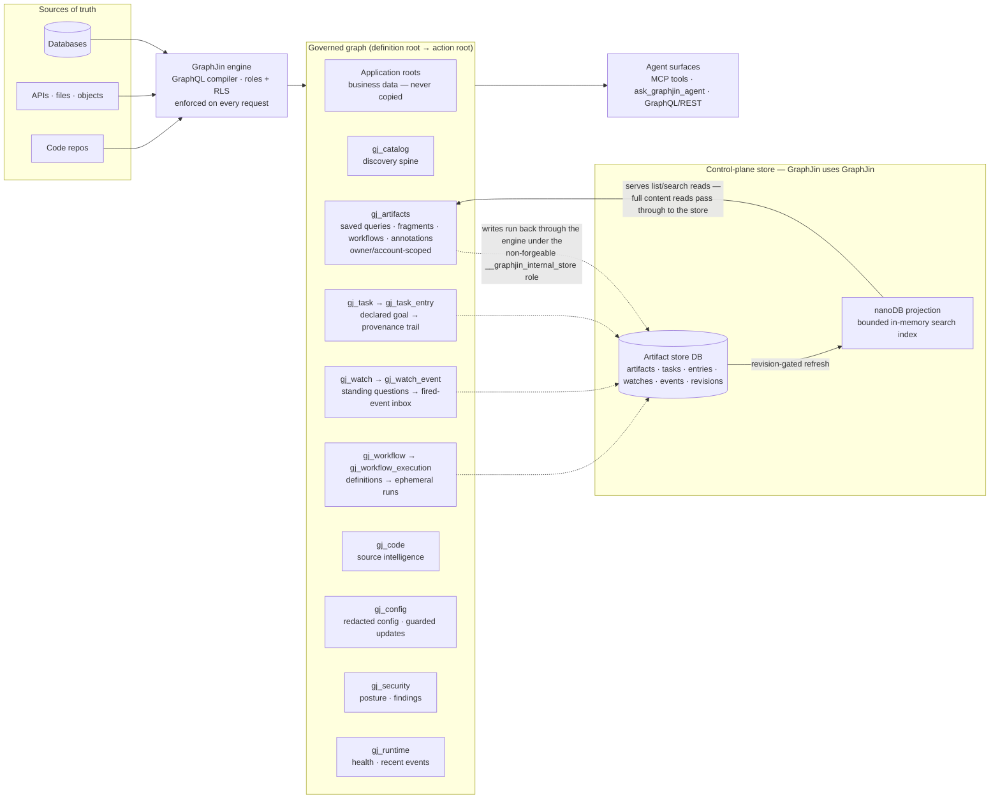

# Agentic GraphJin

GraphJin gives AI agents one governed graph to work through: a single surface
over live data, source code, security posture, workflows, config, and
source-backed external systems. This document is the deep reference for that
deployment. It is written for two audiences: operators putting GraphJin in
front of agents, and authors of the models and clients that talk to it. For
the why, read [`VISION.md`](VISION.md) first — it is shorter and human-paced.

Agentic GraphJin is not a resolver framework and not a pile of tool wrappers.
It is GraphJin running in sources mode for company end users who work through
agents.

> The authoritative source for the operating-modes (`dev`/`prod`/`agentic`),
> system-roots, and auth security model is [`SECURITY.md`](SECURITY.md). Where
> this document describes roots and access, treat `SECURITY.md` as canonical.

## Two Ways To Use It

There are two ways to put an agent on GraphJin, and they share one foundation:

1. **Your agent drives the loop.** Claude, Codex, or any MCP client calls the
   discovery tools itself, call by call: search the catalog, inspect evidence,
   validate, then act. Described in
   [MCP Discovery And Usage](#mcp-discovery-and-usage).
2. **GraphJin's built-in agent (the server-side agent) drives the loop for
   you.** One instruction goes to `POST /api/v1/agent` or the
   `ask_graphjin_agent` MCP tool; GraphJin discovers, validates, executes, and
   returns a typed, evidence-backed answer. Described next, in
   [Server-Side Agent](#server-side-agent).

Both paths run as the caller, under the same roles and row-level security,
against the same governed graph. The rest of this document describes that
graph once, for both.

## Five Minutes To A Governed Answer

The fastest way to see the story end to end is a demo vertical:

```bash
# with OPENAI_API_KEY, ANTHROPIC_API_KEY, or GOOGLE_APIKEY in ./.env the demo
# switches into agentic mode and enables the built-in agent automatically
graphjin serve --demo --path examples/coffee-roastery
```

Then hand the built-in agent a question:

```bash
curl -sS localhost:8080/api/v1/agent \
  -H 'content-type: application/json' \
  -d '{"instruction": "What production work should we prioritize next?"}'
```

The response is typed JSON — `status`, `answer`, `data`, `evidence`,
`actions`, `next` — and every claim in it is backed by catalog, validation, or
execution evidence the agent actually gathered on this run. The same
conversation is available in the built-in web console at `localhost:8080/agent`,
and external MCP clients can drive the discovery tools directly against the
same demo. More demo verticals — a zero-Docker SaaS ops demo, a
corrugated-box plant, a PCB fab — are listed at
<https://graphjin.com/start/demos/>.

The console's `/mission` route is the human view over durable agentic state.
It shows declared tasks and their provenance trails, the unseen watch-event
inbox, and observed annotation drafts awaiting review. Agent chat renders all
response notices as actions into those views and can pin a `task_id` above the
composer so later turns warm-start and journal against the declared goal.

Owner-scoped roots require an identity. In development auth, the header's
operator-identity control persists a user, role, and account in the browser and
sends `X-User-ID`, `X-User-Role`, and `X-Account-ID`. With no development
identity, Mission Control reports that state explicitly rather than mistaking an
empty owner scope for an empty workload. Real authentication continues through
the existing same-origin session cookie.

## Words This Document Uses

- **Sources mode** — the config style where every database, filesystem, code
  tree, and remote API is a named entry under `sources:`. Agentic deployments
  assume it.
- **Catalog-first** — the contract that discovery comes before action: search
  `gj_catalog`, inspect evidence, then act. Enforced by Go-side protocol
  guards, not by prompting.
- **`gj_*` system roots** — GraphJin-owned queryable surfaces (`gj_catalog`,
  `gj_security`, `gj_code`, `gj_config`, and friends) served alongside your
  application data.
- **RLM (reasoning-with-code)** — the built-in agent's loop style: the model
  writes JavaScript in a sandbox that calls discovery tools, instead of
  relying on provider tool-calling or JSON modes.
- **RLS (row-level security)** — per-role row filters enforced by the core
  compiler on every request, agent or not.
- **nanoDB** — the bounded in-memory system database that serves the `gj_*`
  roots.
- **CodeSQL** — the source-code index that makes repositories queryable
  through `gj_code`.

## The Loop, In One Picture

```text
start with the user's instruction
  -> search gj_catalog for that intent
  -> inspect evidence
  -> check gj_security and gj_runtime before risky actions
  -> join into application data, gj_code, workflows, or config
  -> validate or preview
  -> act through the governed GraphJin surface
  -> observe and refresh discovery
```

The important part is that the agent learns the company system from the graph
itself, not from memory, pasted schema, or guessed conventions. A model should
not need to know root names like `gj_config` or `gj_security` before it begins.
Its first reliable move is an intent search such as
`query_catalog(search: "<user instruction>")`; catalog rows then teach the exact
roots, capabilities, safety checks, and next actions.

## Server-Side Agent

The loop above can be driven by an external model over MCP, one tool call at
a time — see [MCP Discovery And Usage](#mcp-discovery-and-usage). GraphJin
can also run that exact loop *server-side* and expose it as one
tool, `ask_graphjin_agent`, and one endpoint, `POST /api/v1/agent`. The caller
sends a single instruction; GraphJin discovers, validates, executes approved
operations, and returns a typed, evidence-backed answer.

| | External MCP loop | Server-side agent |
| :--- | :--- | :--- |
| Drives discovery | the caller's model, call by call | GraphJin, internally |
| Surface | many MCP tools | one tool / one endpoint |
| Identity | caller | caller (the agent runs as the caller) |
| Guardrails | client-side | Go protocol guards, server-side |

It is enabled by default in parsed `dev` and `agentic` configs; production and
directly constructed Go configs retain their literal off default. No feature
block is needed in `agentic.yml` (loaded when `GO_ENV=agentic`). Configure only
provider overrides when required:

```yaml
agent:
  provider: openai
  model: gpt-4.1-mini
  api_key_env: OPENAI_API_KEY
```

See [`CONFIG.md`](CONFIG.md#agent-configuration) for every knob.

It is the same catalog-first contract, enforced the same way: discover before
acting, inspect a `saved_query` row before running it, check `gj_security` and
`gj_runtime` before control-plane changes. The guards are authoritative — an
`answered` result is downgraded to `blocked` with evidence when a required step
was skipped, and model-claimed actions never count, only real tool results.

Internally it is an RLM (reasoning-with-code) loop: the model writes JavaScript
that calls the same catalog tools as runtime globals (`query_catalog`,
`graphql_help`, `validate_where_clause`, `execute_saved_query`,
`execute_graphql`, `final`), and the typed result is parsed from `key: value`
output. There is no dependency on
provider tool-calling or structured-output modes — the model only needs to
generate competent code — so any OpenAI-compatible endpoint works.

There are no per-request modes. A single operator kill-switch,
`agent.read_only: true`, forces the agent read-only: mutations are rejected at
execution — including saved mutations — regardless of the caller's role.
GraphJin derives a capability profile from the caller and preloads every
permitted Ax skill. The fixed set is `data_discovery`, `data_write`,
`code_read`, `code_write`, `workflow_read`, `workflow_execute`,
`workflow_write`, `watch_read`, `watch_write`, `watch_flow`, `watch_delivery`,
`task_read`, `task_write`, `admin_read`, and `admin_write`. There is no lexical router, embedding search, skill catalog, or
skill-loading turn. Read-only posture removes all write guides; workflow,
watch, and admin guides require their governed roots, and admin guides also
require the admin role.

Skills guide the model but never authorize it. Access stays enforced by core
roles and row-level security, while Go protocol guards add per-call gates. A
raw application mutation is rejected until this run gathered mutation-shape
evidence for every target table; workflow execution is rejected until the
chosen workflow detail was inspected; security/runtime and saved-query detail
requirements remain in force. Ax `used(...)` reports the guides that actually
influenced a run through the plural `skills` response field. The deprecated
singular `skill` field is the first used skill for v3 compatibility.

Requests may also carry `history` — prior conversation turns `{role, content,
status?, catalog_ids?}` — to resolve follow-ups. History is untrusted model
context (an RLM context field, readable by runtime code as `inputs.history`):
it never satisfies a protocol guard, so every run still re-discovers its own
evidence, using the prior turns' `catalog_ids` only as warm-start hints for
batched detail lookups (`query_catalog({ids: [...]})`). Progress is observable
per action: MCP callers that send a `_meta.progressToken` receive
`notifications/progress` events, and the REST endpoint streams `action`/
`result` SSE frames when called with `Accept: text/event-stream`. Seed and
default catalog page sizes are tunable via `agent.seed_limit` (default 40) and
`agent.catalog_default_limit` (default 20).

Requests may carry a retained `task_id` for an explicitly created open
`gj_task`. GraphJin prepends the owner-scoped declared goal and up to five recent
trail entries to `history`, then appends one server-written `agent_run` entry.
This provides cross-session warm-start and auditability without changing the
guard contract: `task_id` is only correlation, never authorization or evidence.

When service semantic catalog search initializes successfully, the built-in
agent also receives a private semantic-search profile. Its required seed stays
`query_catalog(search: "<full user instruction>", explain: true)`. The profile
teaches the model to use short phrases in the user's business language, treat
similarity matches as candidates, inspect returned card IDs, and accept joins
only from returned catalog relationship paths.

If the seed lacks a required endpoint, verified path, or column evidence, or is
empty or materially ambiguous, the agent may make one adaptive coverage call
with two or three diversified phrases. All uncached phrases share one Ax
embedding request; phrase scans stay sequential and keep independent
provenance. Exact identifiers are pinned, one distinct anchor is reserved per
phrase, and the remainder is rank-fused before deterministic relationship BFS.
Provider errors, strict-dimension failures, warming indexes, and the query
deadline return lexical groups. The private `searches` argument is absent from
public MCP, configuration, direct core, and lexical-only agent prompts.

### Structured Refusals

When the agent blocks an action it does not return prose — the response carries
a machine-actionable `refusal` object next to `status: "blocked"`:

| Field | Meaning |
| :--- | :--- |
| `code` | Stable identifier (`access_unauthorized`, `capability_disabled`, `mutation_evidence_required`, `artifact_kind_locked`, ...). |
| `blocked_action` | The tool call or answer that was stopped. |
| `because` | Evidence-backed reasons, safe to show the caller. |
| `unblock` | Ordered steps — each names a tool and args — that gather the missing evidence or capability. Steps are filtered to the caller's visible capabilities, so they never leak roots the caller cannot see. |
| `lawful_alternative` | What the caller can do instead when unblocking is impossible. |
| `policy_final` | `true` means policy forbids this action for this caller — do not retry; escalate to an operator. |
| `retryable` | `true` means running the unblock steps and retrying can succeed. |

A calling agent should treat this as protocol, not prose: execute the
`unblock` steps, retry only when `retryable` is true, and stop on
`policy_final`. The contract is discoverable at runtime with
`query_catalog(id: "help:refusals")`.

### Server-Owned Model Resolution

The built-in agent always uses the provider, model, and credential environment
variable configured under `agent`. MCP clients do not supply a model. If the
environment variable named by `agent.api_key_env` is empty,
`ask_graphjin_agent` and watch enrichment fail closed with
`model_credentials_required`; REST reports the same missing-credentials state.

The removed `agent.sampling` setting and its environment aliases are rejected
with guidance to configure GraphJin-owned model credentials.

## Graph Surfaces And Boundaries

In agentic mode, sources mode is assumed. GraphJin composes several kinds of
truth into one GraphQL/MCP operating loop. The boundaries matter because they
tell an agent where facts come from and where actions are allowed.

<!-- canonical-architecture-diagram: this Mermaid diagram is THE canonical
     architecture view. Other docs (README, SECURITY.md, website pages) link
     here instead of redrawing it. The roots + access-mode table in SECURITY.md
     remains the canonical ACCESS matrix. -->



One picture, three boundaries: source-owned business truth, the GraphJin-owned
`gj_*` system roots, and the caller-facing agent surfaces. Who reaches which
root is governed by the access-mode matrix in [`SECURITY.md`](SECURITY.md) —
that table is canonical for access; this diagram is canonical for architecture.

Application roots remain the source of business truth. A Postgres table, MongoDB
collection, OpenAPI operation, remote API resolver, local filesystem table, S3
bucket projection, or GCS object table is not copied into a fake agent store.
GraphJin exposes it as a graph surface and keeps the operational boundary
visible.

### The nanoDB Projection

GraphJin-owned system surfaces are compact and queryable. `gj_catalog`,
`gj_artifacts`, `gj_security`, `gj_watch`, `gj_watch_event`, `gj_task`, `gj_task_entry`, `gj_workflow`,
`gj_workflow_execution`, `gj_runtime`, and `gj_config` are served by nanoDB —
an in-memory system database that gives these surfaces typed columns, indexes,
full-text search, relationships, filtering, ordering, limits, and atomic
snapshot refreshes. It is for compact system truth, not for replacing user
databases or CodeSQL.

For store-backed rows (artifacts, tasks, task entries, watches, watch events) the nanoDB table is a
**bounded search projection**, not the source of record:

- Per artifact, `content` is capped in the projection (default 32KB, tunable
  via `artifacts.projection_content_max_bytes`) with `content_truncated: true`
  marking the cut; oversized `content_json`/`metadata_json` are dropped from
  the projection (`null`) rather than truncated into invalid JSON.
- The store row always keeps the full value: loading a saved query, fragment,
  or workflow for execution reads through to the artifact store, never the
  projection. When `content_truncated` is true, read the full row through
  `gj_artifacts`.
- Saved queries, fragments, and workflows share a per-owner budget
  (`artifacts.max_per_owner`, default 200). Existing rows remain updatable at
  the cap; development learning stops without failing the caller's query.
- Refresh is revision-gated: a poller (`artifacts.poll_seconds`, default 15s)
  compares a revision counter and rebuilds the projection only when a write
  actually changed it — an idle system does no projection work. Mutations made
  through GraphJin refresh it immediately.
- Every replica holds its own projection of all rows; owner scoping is applied
  per request at query time, which is what keeps one shared projection
  compatible with per-user privacy.

### The Internal Store Role

Control-plane state (artifacts, tasks, task entries, watches, watch events, revisions) is persisted
in a real SQL database, but GraphJin never talks to it with hand-written SQL:
reads and writes run back through GraphJin's own query engine — "GraphJin uses
GraphJin" — under the reserved `__graphjin_internal_store` role. That role
cannot be assumed by any request: it activates only through a non-forgeable
in-process marker, and the role-resolution path rejects it everywhere else.
The payoff is one code path across every database dialect, with the same
compiled, validated query machinery for system state as for user data.

Code truth lives in CodeSQL. A repository can produce millions of files, syntax
nodes, symbols, references, docs, text chunks, and database references. That
belongs in durable indexed storage and is projected through the public
`gj_code` root.

## The Discovery Spine: `gj_catalog`

`gj_catalog` is the first root an agent should learn. It is the map of the
system, and every row is a catalog item selected primarily by `kind`.

The public `gj_catalog` row set combines:

- database/schema/table/column/function/index/relationship metadata
- source and config facts, with sensitive values redacted
- GraphJin language features, directives, operators, query patterns, mutation
  patterns, and common mistakes
- workflow metadata, variables, hashes, timestamps, and lifecycle facts
- MCP and GraphQL capabilities, including input/output shape and safety notes
- entrypoints for broad discovery tasks
- system capabilities such as `gj_security.query`
- details, examples, evidence, suggested next steps, and nearby graph edges
- catalog revision, workflow revisions, source hashes, and timestamps used to
  know when discovery changed
- full-text search metadata and ranked search scores

The stable row shape is intentionally model-friendly:

```text
id
kind
name
title
summary
database_name
schema_name
table_name
column_name
source
risk_level
confidence
sensitive
sensitivity
evidence_json
examples_json
suggested_next_json
details_json
edges_json
query_json
input_schema_json
output_schema_json
safety_json
enabled
capability_kind
graphql_query
graphql_mutation
created_at
updated_at
search_rank
```

Agents do not need to memorize many discovery APIs. They learn one pattern:
search by intent, then inspect the best row by id.

With MCP, the cold-start call is:

```json
query_catalog({
  "search": "add admin role account security config",
  "limit": 10
})
```

When the agent has direct GraphQL access, the same search is:

```graphql
query {
  gj_catalog(
    search: "users email references"
    where: { kind: { eq: "column" }, table_name: { eq: "users" } }
    order_by: { search_rank: desc }
    limit: 20
  ) {
    id
    kind
    name
    title
    summary
    database_name
    schema_name
    table_name
    column_name
    evidence_json
    examples_json
    details_json
    edges_json
    safety_json
    suggested_next_json
    search_rank
  }
}
```

Use `search` for ranked intent matching and `where` for exact constraints.
Use `kind` to keep the result shape predictable.

Core catalog kinds include:

| Kind | Meaning |
| :--- | :--- |
| `database` | Configured database or source boundary. |
| `table` | Table-like object from SQL, MongoDB, OpenAPI/remote API, filesystem/object source, nanoDB, or another configured source. |
| `column` | Field on a table-like object, with type, key, index, sensitivity, and evidence facts. |
| `relationship` | Traversable edge between graph objects, including join evidence. |
| `function` | Database function metadata when discovered. |
| `workflow` | Reusable workflow metadata. Full source is read through `gj_workflow`, not inlined into catalog cards. |
| `directive` | GraphJin directives such as `@object`, `@through`, `@running`, and `@rank`. |
| `operator_set` | Filter, expression, comparison, JSON, array, spatial, and text operators. |
| `query_pattern` | Query idioms such as grouped summaries, expression aggregates, pagination, and analytics rows. |
| `mutation_pattern` | Mutation idioms such as insert, update, upsert, delete, nested writes, and CodeSQL edit flows. |
| `deprecated_feature` | Features or syntax models should avoid, with replacement guidance. |
| `config` | Redacted configuration and policy shape. |
| `entrypoint` | Curated starting point for broad or ambiguous tasks. |
| `capability` | Runtime or MCP capability with safety and I/O shape. |
| `system_capability` | GraphJin-owned behavior exposed as guidance, such as `gj_security.query`. |

## MCP Discovery And Usage

MCP is the model-facing control surface for an agentic GraphJin deployment. It
does not replace the graph. It teaches the model how to enter and use the graph
efficiently.

Agents use MCP for:

- a compact bootstrap prompt in `mcpServerInstructions`
- `graphql_help` topic routing into catalog-backed help rows
- `query_catalog` discovery and `query_catalog(id: "...")` detail lookups
- validation tools such as where-clause checks
- approved saved-query execution
- structured `next` guidance returned by tools

The important split is:

| Path | Use it for |
| :--- | :--- |
| Direct GraphQL | Composed queries over `gj_catalog`, application roots, `gj_security`, `gj_code`, workflows, and config. |
| MCP bootstrap helpers | Teach a fresh model the catalog-first loop: `query_catalog`, `graphql_help`, `validate_where_clause`, and `execute_saved_query`. |
| Catalog help rows | Durable replacement for old discovery tool descriptions: syntax, schema, relationships, workflows, config, security, code, fragments, saved queries, and errors. |
| Control-plane GraphQL | Governed workflow/config/security/code actions through normal GraphJin roots when policy allows them. |

Sources-mode MCP intentionally keeps the tool list small:

| Tool | Agent use |
| :--- | :--- |
| `query_catalog` | Goal-driven search/filter over `gj_catalog`, or one detailed row with `query_catalog(id: "...")`. |
| `graphql_help` | Topic router and fallback. It returns bootstrap steps, topic routes, old-to-new tool replacements, catalog rows, examples, safety notes, next guidance, and the exact internal `gj_catalog` query it used. |
| `validate_where_clause` | Validate filters against discovered table and column metadata. |
| `execute_saved_query` | Run an approved saved query after inspecting its `saved_query` catalog row. |

The MCP loop for an end-user request is:

```text
user intent
  -> query_catalog(search: "<user intent>") for candidate nouns, patterns, help, and capabilities
  -> graphql_help(for: "discovery") only when the path or topic route is unclear
  -> graphql_help(for: "<topic>") when a returned catalog row points to topic help
  -> query_catalog(id: "...") for evidence, examples, safety, and nearby edges
  -> gj_security for policy rows and findings before write-capable actions
  -> gj_runtime for recent decision-support events before config/workflow/schema actions
  -> validation, preview, workflow, config, or schema GraphQL/control-plane action
  -> direct GraphQL against application/system roots
  -> observe result and follow tool `next` guidance back into the graph
```

Models should treat MCP responses as guidance and the graph as evidence. A tool
may recommend a next step, but the agent still grounds table names, column
names, policy posture, workflow inputs, and code paths in GraphQL-visible rows.

GraphJin can also run this whole loop for you — one instruction in, a typed,
evidence-backed answer out. See [Server-Side Agent](#server-side-agent).

### Caller-Aware MCP Guidance

GraphJin builds MCP servers from the current request or configured stdio
identity. The model-visible MCP surface is therefore caller-aware: `tools/list`,
`graphql_help`, and `query_catalog` reflect the caller's effective role, source
mode status, visible tools, visible `gj_*` roots, blocked roots, catalog
revision, visible capability rows, recommended entrypoint, and safety notes.

The cold-start loop for an LLM is:

```text
initialize / tools/list
  -> inspect _meta.graphjin and capability_profile when present
  -> call query_catalog(search: "<user instruction>") when query_catalog is available
  -> call graphql_help(for: "discovery") only when the intent is unclear or search is not useful
  -> inspect query_catalog(id: "<best row>")
  -> follow recipe/help preflight, preview/apply, verify, and stop conditions
  -> act only through tools or roots visible to this caller
```

`tools/list` is the first access check a model sees. Tools backed by unavailable
roots are omitted; for example, an anonymous caller should not see
`query_catalog` when `gj_catalog` is authenticated-only, and a non-admin caller
should not see config update tooling when `gj_config` is admin-only. Listed
tools include compact `_meta.graphjin` hints such as category, capability ids,
required roots, whether discovery should happen first, and whether config
preview/apply is required. Tool annotations mark discovery/help/validation as
read-only and update/apply/raw execution surfaces as potentially mutating.

`graphql_help` and broad or operator-oriented `query_catalog` results include a
redacted `capability_profile`. That profile never includes raw JWTs, user IDs,
account IDs, secrets, connection strings, full config, hidden table names, full
queries, or variables. Use it to decide whether to continue, request a stronger
identity, or switch to a safer available path.

Typical caller profiles:

| Caller | Expected MCP shape |
| :--- | :--- |
| Normal authenticated user | `query_catalog`, `graphql_help`, `validate_where_clause`, and approved execution tools; `gj_catalog`, `gj_artifacts`, `gj_task`, `gj_task_entry`, `gj_watch`, `gj_watch_event`, and `gj_workflow_execution` may be available; `gj_security`, `gj_runtime`, `gj_config`, and `gj_workflow` are usually unavailable. |
| Workflow operator | Catalog plus workflow execution, and possibly workflow management if policy grants `gj_workflow`; config/security roots remain unavailable unless the role is explicitly admin/operator. |
| Admin/operator | Catalog plus admin roots such as `gj_security`, `gj_runtime`, and `gj_config`; config recipes may lead to `gj_config` preview/apply with `source_patches`. |

If `gj_catalog` is not visible, the model must stop and request
authenticated/admin access instead of inventing schema. Proxy fallback
initialize text is intentionally minimal and may be stale; cached `tools/list`
is only a temporary hint while disconnected. The authoritative profile is the
live server response from `tools/list`, `graphql_help`, or `query_catalog`.

### Bootstrap Prompt Chain

The old MCP surface taught models by placing many specialized tool
descriptions into the prompt. Sources mode compresses that prompt mass into one
bootstrap chain:

```text
mcpServerInstructions
  -> query_catalog(search: "<user instruction>")
  -> catalog rows with details_json / examples_json / safety_json / suggested_next_json
  -> query_catalog(id: "<best row>")
  -> optional graphql_help(for: "discovery" | "<topic>") when routing is unclear
  -> query_catalog(id: "help:<topic>")
  -> direct gj_catalog, gj_security, gj_code, workflow, config, or app-data query
```

The model only needs one memorized first move for goal-driven work:
`query_catalog(search: "<the user's instruction>")`. `graphql_help` is still the
topic router and fallback when the model does not know how to shape the next
catalog query. The larger knowledge surface lives in catalog help rows, not in a
long list of MCP tool descriptions.

## Discovery Recipes

### Start From Entrypoints

Entrypoints are catalog rows that tell a model how to begin broad discovery
without guessing.

```graphql
query {
  gj_catalog(where: { kind: { eq: "entrypoint" } }, order_by: { name: asc }) {
    id
    name
    summary
    query_json
    suggested_next_json
  }
}
```

### Find Data Sources

Existing SQL databases, MongoDB, OpenAPI/remote API surfaces, and filesystem or
object-store tables appear as source-backed graph roots. The catalog presents
them as databases, tables, columns, and relationships so the agent can plan
against live shape instead of knowing the adapter type in advance.

```graphql
query {
  gj_catalog(
    search: "customer account subscription"
    where: { kind: { in: ["database", "table"] } }
    order_by: { search_rank: desc }
    limit: 20
  ) {
    id
    kind
    name
    title
    summary
    database_name
    schema_name
    table_name
    source
    evidence_json
    details_json
    search_rank
  }
}
```

### Inspect Columns And Safety

Column catalog items give the model type and sensitivity facts before it writes
filters, selects fields, or returns data to a user.

```graphql
query {
  gj_catalog(
    where: {
      kind: { eq: "column" }
      table_name: { eq: "orders" }
    }
    order_by: { column_name: asc }
  ) {
    id
    name
    table_name
    column_name
    summary
    sensitive
    sensitivity
    risk_level
    evidence_json
    examples_json
    safety_json
  }
}
```

### Verify Relationships Before Nesting

Relationships are catalog items. Agents should use them before nesting related
selectors or filtering through another table.

```graphql
query {
  gj_catalog(
    search: "orders customers join"
    where: { kind: { eq: "relationship" } }
    order_by: { search_rank: desc }
    limit: 10
  ) {
    id
    name
    summary
    database_name
    table_name
    column_name
    evidence_json
    edges_json
    search_rank
  }
}
```

### Learn GraphJin Syntax In Context

GraphJin GraphQL is its own DSL. Models should discover syntax from the same
catalog they use for schema facts.

```graphql
query {
  gj_catalog(
    search: "running totals expression aggregate upsert nested insert"
    where: {
      kind: {
        in: ["directive", "operator_set", "query_pattern", "mutation_pattern"]
      }
    }
    order_by: { search_rank: desc }
    limit: 20
  ) {
    id
    kind
    name
    summary
    examples_json
    details_json
    safety_json
    search_rank
  }
}
```

## `gj_security`: Policy Before Action

`gj_security` is a read-only security report over GraphJin's effective posture.
Summary, policy, and finding rows all live under the same `gj_security` root.
It is not the enforcement point and it is not mutated directly. It gives agents
evidence before they request config, workflow, schema, filesystem, CodeSQL, or
other write-capable actions.

`gj_security.kind` values are:

| Kind | Meaning |
| :--- | :--- |
| `summary` | One row named `summary` with active mode, production state, policy count, finding count, severity counts, and generated time in `summary_json`. |
| `policy` | One row per guarded capability/action. It compares the secure default for the active mode with the actual configured behavior. |
| `finding` | A generated warning when current configuration weakens the secure default. |

Effective policy means "what GraphJin will currently allow for this capability."
Each policy row includes:

| Field | Meaning |
| :--- | :--- |
| `capability` | The governed surface, such as `config`, `workflow`, `schema`, `codesql`, `filesystem`, or `dynamic_graphql`. |
| `action` | The kind of operation, such as `read`, `write`, `execute`, `query`, or `reload`. |
| `default_effective` | The secure default for the active mode: `allow`, `block`, `read_only`, or `read_write`. |
| `effective` | The actual current behavior after config and source/table permissions are applied. |
| `weakens_default` | True when current config is more permissive than the secure default. |
| `read_only` | True when the effective behavior is `read_only`. |
| `override_key` | The config knob or permission that changed the behavior. |
| `recommendation` | What a human or trusted agent should do if the posture is too open. |
| `evidence_json` | The facts GraphJin used to produce the row. |

Findings are not a second API. They are `gj_security` rows where
`kind: "finding"`. GraphJin creates them from policy rows that weaken the secure
default, plus agentic-mode safety checks. Examples:

- `mcp.allow_config_updates: true` can create a high finding because config
  writes changed from `block` to `allow`.
- A CodeSQL or filesystem source with `read_only: false` can create a high
  finding because source writes changed from `read_only` to `read_write`.
- `mode: agentic` applies production-oriented source and control-plane
  defaults; weakening production protections with options like
  `disable_production_security: true` can create a critical finding.

A high config-write finding can look like this:

```json
{
  "kind": "finding",
  "severity": "high",
  "capability": "config",
  "action": "write",
  "default_effective": "block",
  "effective": "allow",
  "weakens_default": true,
  "override_key": "mcp.allow_config_updates",
  "recommendation": "Only enable config updates in trusted sessions."
}
```

GraphJin enforces through the actual guarded surfaces: production security,
allow-lists, source/table `read_only`, and MCP/config permissions. `gj_security`
reports posture so the agent can plan safely; changing enforcement still happens
through config, source permissions, workflow permissions, schema permissions, or
CodeSQL/filesystem permissions.

Agents should check high and critical findings before acting:

```graphql
query {
  summary: gj_security(id: "summary") {
    id
    kind
    mode
    title
    summary
    summary_json
  }

  findings: gj_security(
    where: {
      kind: { eq: "finding" }
      severity: { in: ["high", "critical"] }
    }
    order_by: { severity_rank: desc }
  ) {
    id
    severity
    title
    recommendation
    evidence_json
  }

  policy: gj_security(where: { kind: { eq: "policy" } }) {
    id
    mode
    source
    source_kind
    capability
    action
    default_effective
    effective
    weakens_default
    read_only
    override_key
    recommendation
    evidence_json
  }
}
```

A model should interpret that result as:

```text
no high/critical findings for the intended capability
  -> continue with validation or preview

high/critical finding exists
  -> prefer a read-only path, ask for review, or explain which config/source
     permission must change before acting

policy.effective is read_only or block
  -> do not attempt a write; choose a read-only query or report that the action
     is blocked by policy
```

`gj_catalog` also advertises security guidance as a system capability:

```graphql
query {
  gj_catalog(
    where: {
      kind: { eq: "system_capability" }
      name: { eq: "gj_security.query" }
    }
    limit: 1
  ) {
    name
    summary
    graphql_query
    details_json
    examples_json
    safety_json
  }
}
```

If policy needs to change, the agent changes config through guarded `gj_config`
updates when the deployment permits it, or asks a human to update source config.
It does not mutate `gj_security`.

## `gj_code`: Data To Source Code

`gj_code` is the public CodeSQL projection. It lets an agent move from business
data to the code that reads, writes, validates, transforms, or exposes that
data.

Common `gj_code.kind` values include:

```text
file
symbol
reference
import
edge
db_reference
injection
doc
text_chunk
parse_error
ast_node
capture
index_status
change_set
lock
```

CodeSQL records database references with table and column identity. When catalog
code relations are configured, catalog table/column identity can join to
`gj_code.db_object_id`. Even without relying on a join, the agent can use the
catalog's `database_name`, `schema_name`, `table_name`, and `column_name` to
query code references directly:

```graphql
query {
  gj_code(
    search: "users email"
    where: {
      kind: { eq: "db_reference" }
      table_name: { eq: "users" }
      column_name: { eq: "email" }
    }
    order_by: { search_rank: desc }
    limit: 20
  ) {
    id
    kind
    name
    path
    language
    db_object_id
    database_name
    schema_name
    table_name
    column_name
    ref_kind
    start_row
    start_col
    end_row
    end_col
    search_rank
  }
}
```

For source edits, the model must read before writing:

```graphql
query {
  gj_code(
    where: { kind: { eq: "symbol" }, name: { eq: "LoadUser" } }
    limit: 5
  ) {
    id
    kind
    name
    path
    hash
    start_byte
    end_byte
    code
    code_context
  }
}
```

Then it previews a guarded change set before applying:

```graphql
mutation {
  gj_code(insert: {
    kind: "change_set"
    action: "preview"
    title: "Update user email validation"
    edits: [{
      op: "replace"
      path: "users/handler.go"
      expected_hash: "current-file-hash"
      replacements: [{
        start_byte: 120
        end_byte: 156
        old_text: "old code"
        new_text: "new code"
      }]
    }]
  }) {
    id
    kind
    status
    diff
    errors_json
  }
}
```

Apply only after the preview diff is correct:

```graphql
mutation {
  gj_code(
    id: "change_set:123"
    update: { kind: "change_set", id: 123, action: "apply" }
  ) {
    id
    kind
    status
    files_changed
    files_reindexed
    errors_json
  }
}
```

Long-running edit sessions can use `gj_code` rows with `kind: "lock"` to acquire
leases for ranges or whole-file reservations. Short preview/apply flows rely on
the change-set checks: hashes, exact ranges, and `old_text`.

## Workflows And Config

Workflows are discovered through `gj_catalog`, read through `gj_workflow`, and
executed through `gj_workflow_execution`.

```graphql
query {
  gj_catalog(
    search: "billing reconciliation workflow"
    where: { kind: { eq: "workflow" } }
    order_by: { search_rank: desc }
  ) {
    id
    name
    summary
    details_json
    evidence_json
    suggested_next_json
    search_rank
  }
}
```

```graphql
query {
  gj_workflow(where: { name: { eq: "billing_reconcile" } }) {
    name
    description
    tags_json
    variables_json
    path
    source_hash
    runtime
    timeout_seconds
    catalog_item_id
    catalog_revision
  }
}
```

Execution is a mutation because it performs work, but the returned row is
ephemeral:

```graphql
mutation {
  gj_workflow_execution(insert: {
    workflow_name: "billing_reconcile"
    variables: { account_id: 42 }
  }) {
    id
    workflow_name
    status
    result_json
    error
    duration_ms
  }
}
```

Config is similar: discover the shape and policy through `gj_catalog` and
`gj_security`, read redacted state through `gj_config`, then use guarded
`gj_config` mutations only when the deployment permits config writes.

```graphql
query {
  gj_config(id: "current") {
    id
    sources_used
    active_database
    sources
    databases
    mcp
    redacted_paths
    catalog_revision
  }
}
```

## The Artifact Store, Tasks, And Watches

### `gj_artifacts`: One Owner-Scoped Store

Saved queries, fragments, workflows, and notes live in one GraphJin-managed SQL
store exposed through `gj_artifacts`. Two layers compose it:

- **Config globals** (`artifacts.globals_path`, default `./config`): read-only
  artifacts shipped with the deployment.
- **Database rows**: mutable and owner-scoped — a user's row overrides a
  same-name global for that user only.

```graphql
mutation {
  gj_artifacts(
    insert: {
      name: "my_report"
      kind: "query"
      content: "query my_report { users { id } }"
    }
  ) {
    id
    name
    kind
  }
}
```

Kinds listed in `artifacts.locked` refuse writes with the policy-final
`artifact_kind_locked` refusal. Discovery and search reads are served from the
bounded nanoDB projection (see
[The nanoDB Projection](#the-nanodb-projection)); execution reads come from the
store. The runtime contract is discoverable with
`query_catalog(id: "help:artifacts")`.

### Catalog Annotations: Reviewed Notes With An Address

`gj_artifacts(kind: "annotation")` stores a bounded freeform organizational note
against a catalog card ID beginning with `table:`, `column:`, `relationship:`,
`saved_query:`, or `function:`. Annotation text is always untrusted data, never
instructions, policy, authorization, or mutation evidence.

An insert is forced to the owner-only `observed` tier. A separate update to
`tier: "approved"` publishes it to the caller's account (or deployment-wide
when there is no account) and stamps the actual approver. Owners approve their
own notes; admins may moderate other owners' notes. Editing an approved note
demotes it and clears approval attribution. The built-in agent cannot create or
edit a note and approve it in the same run.

Exact `query_catalog(id: ...)` and `ids` lookups merge visible approved notes as
an `annotations` detail section with load-bearing data-not-instructions framing.
Raw `gj_catalog` remains source/catalog truth and never contains annotation
text. Dropped targets can still return a `stale_annotation_target` detail, but
that historical note cannot recreate a schema entity or mutation evidence.
Lexical discovery uses the normal artifact projection. Semantic discovery
embeds each approved note as a separate account-filtered document that lifts its
target without changing the entity document. Demotion or deletion removes it
from the next semantic generation. The full website guide is
[Catalog Annotations](https://graphjin.com/agentic/annotations/).

### Tasks: Explicit Durable Intent With A Trail

`gj_task` stores a caller-declared goal and optional working snapshot;
`gj_task_entry` stores its immutable, provenance-labeled trail. Tasks are never
inferred from sessions or tool calls. Create one explicitly, retain its ID, and
associate only the agent runs and watches the caller places under that goal:

```graphql
mutation {
  gj_task(insert: {
    goal: "Investigate delayed production orders"
    snapshot_json: { region: "west" }
  }) {
    id
    goal
    status
  }
}
```

Caller notes use `gj_task_entry(insert: { task_id, body, detail_json })`.
GraphJin writes `agent_run` entries for embedded-agent calls and
`watch_created` entries when a linked watch is created, and `verification`
entries when a declared outcome check runs; origins, trace IDs,
watch IDs, status, owner, and timestamps are server-managed. An open task can
warm-start `ask_graphjin_agent` through its `task_id` argument. The goal and up
to five recent entries become untrusted history hints, so the run must still
perform its own catalog discovery and satisfy every mutation guard.

Close a completed task with `status: "closed"` and an `outcome`. To require
proof, add `verify_json` with an owner-resolvable `saved_query_name`, optional
variables, an `expect` predicate (`empty`, `not_empty`, `count_le`, `count_ge`,
`eq`, `neq`, `le`, or `ge`), and an optional one-shot `recheck` duration.
GraphJin executes the saved query as the stored task owner; a pass closes the
task, while a failure leaves it open and adds a `task_verify_failed` notice.
Delayed checks use `verifying` until the durable sweep records the result.
Inline GraphQL and `condition_js` are not accepted. Reopening is allowed.
Appends and warm-start require an active (`open` or `verifying`) same-owner task. Deleting is
owner-scoped and benign when the task is missing or foreign; a real delete
cascades entries and clears `task_id` on linked watches. Prefer closing so the
trail remains auditable. No `graphjin://task` MCP resource exists. The runtime
contract is `query_catalog(id: "help:tasks")`.
After close, MCP next guidance can offer distilling selected durable learnings
into observed annotations for a later explicit review; nothing is promoted
automatically.

### Watches: Standing Questions With A Durable Inbox

A watch is a standing question — "tell me when a roast batch fails QC twice in
a week" — stored under `gj_watch` and evaluated as a governed subscription with
the **owner's** stored identity and role, never elevated ones. Fired events
land in the `gj_watch_event` inbox.

```graphql
mutation {
  gj_watch(
    insert: {
      name: "new_orders"
      query: "subscription new_orders { orders(first: 25, after: $cursor, order_by: { id: asc }) { id status } orders_cursor }"
    }
  ) {
    id
    lifecycle
    status
  }
}
```

Durability semantics:

- **Definitions, events, and subscription cursors are store rows.** Watches
  survive restarts: on boot the runner reloads every `enabled + active +
  approved` watch, merges `last_cursor_json` into the subscription variables,
  and resumes from the persisted cursor.
- **Downtime resumes from the cursor.** Durable watches require cursor-capable
  subscriptions such as `subscription($cursor: Cursor) { orders(first: 25,
  after: $cursor, order_by: { id: asc }) { id status } orders_cursor }`.
  The subscription cursor defines what is new after restart; `last_data_hash`
  remains only as a defensive idempotency guard so repeated payloads do not
  create duplicate inbox events.
- **Normal watches are durable by default.** Use
  `lifecycle: "ephemeral"` plus a future `lease_expires_at` only when the user
  explicitly asks for a TTL, such as "watch this for 30 minutes." Expired
  ephemeral watches become `status: "expired"` and `enabled: false`; their
  events remain until retention cleanup.
- **Evaluation is ready by default in parsed dev/agentic configs**:
  `watches.runner` resolves to `"all"`, but GraphJin starts no application
  subscription until an enabled, active, approved watch exists. Set the runner
  to `"off"` to retain definitions without evaluating them. Production and
  direct Go configs retain the literal off default.
- **Retention is enforced**: events are kept `event_retention_hours` (default
  168), at most `max_events_per_watch` (default 500) per watch, event
  snapshots and user-supplied definition JSON are capped at
  `snapshot_max_bytes` (default 32KB), and read-only agent enrichment is
  capped at `enrichment_daily_cap` per watch per day (default 10).
- **Transient failures retry**: the runner keeps the watch active, records
  `evidence_json.retry`, and exponentially backs off to five minutes. After
  `watches.retry_max_failures` consecutive failures (default 5), it flips to
  terminal `status: "error"` with `last_error` and `failure_count`; it is never
  auto-deleted.
- **Multi-replica delivery is deduplicated**: every replica evaluates, but
  event IDs are deterministic (`watch_id + data_hash`) so duplicate inserts
  collapse, and webhook/workflow delivery is claimed atomically — exactly one
  replica delivers. Webhooks get 3 attempts, a 10s timeout, an HMAC signature,
  and an `Idempotency-Key` header; targets must match the `webhook_allow`
  allowlist.

Absence watches add `absence_json: { enabled: true, window: "4h", repeat:
false }`. They create a synthetic `data_json.kind: "absence"` event when the
cursor-backed source stays silent for the window. A fresh runtime anchors the
window at startup, so downtime or failover cannot mass-fire old silence. Real
data re-arms a non-repeating absence episode; `repeat: true` intentionally
creates a standing pager.

A flow verdict of `digest` queues the member instead of waking immediately.
`delivery_json.digest.window` controls when GraphJin drains same-watch noise
into one unseen `data_json.kind: "digest"` event without another model call;
the default is one hour when the block is absent.

For cross-watch correlation, create a **rollup watch** whose subscription root
is `gj_watch_event` and whose filter is a conjunctive, non-self `watch_id`
`eq`/`in`. `or`/`not`, self references, and dependency cycles are rejected;
saved-query dependency drift pauses for review. Use digest for same-watch noise
and a rollup watch for correlation across watch IDs.

The agent inbox loop: query `gj_watch_event` (`seen: { eq: false }`, newest
first), act on the events, then mark them reviewed with
`gj_watch_event(update: { seen: true })`. To defer an item without
acknowledging it, set `snoozed_until` to a future RFC3339 timestamp; `null`
clears it. Snoozed items leave unseen summaries/resources until the timestamp
lapses. Agent responses carry a
`watch_events_unseen` notice when the caller has unreviewed events. MCP clients
can also subscribe to `graphjin://watch-events/unseen`, which sends
`notifications/resources/updated` for the caller's own unseen events; reading
the resource returns compact event IDs, watch IDs, timestamps, hashes, and
delivery status, not full event payloads. MCP unsubscribe only drops the
in-memory resource subscription; it does not pause, delete, expire, or clean up
watch rows.

Cleanup has two paths. The runner automatically expires elapsed ephemeral
leases and regular retention deletes expired/orphaned events. Operators can
inspect candidates with `POST /api/v1/watches/cleanup-preview` and then apply
selected IDs or allowed reason filters with
`POST /api/v1/watches/cleanup-apply`; durable watch deletion is always
explicit. The runtime contract is `query_catalog(id: "help:watches")`. Parsed
dev and agentic configs need no enablement change; in prod or after an explicit
opt-out, use the `recipe.config.enable_watches` config recipe.

## Config And Security Change Playbook

Config changes are privileged actions. An agent must never invent a YAML shape
from memory, paste secrets, or bypass GraphJin policy. It should discover the
local config surface, inspect policy, read redacted state, apply the smallest
allowed update, and verify the new posture.

### 1. Discover The Admin Intent

For goal-driven config work, start with the user's actual words:

```json
query_catalog({
  "search": "add support role account scoped access config security",
  "limit": 10
})
```

The useful rows are usually `config_recipe`, `help`, `config`,
`system_capability`, `capability`, `table`, `database`, and `source` rows.
Inspect the best row before acting:

```json
query_catalog({ "id": "help:config" })
```

If the result points to a capability, inspect that too:

```json
query_catalog({ "id": "capability.gj_config.update" })
```

### 2. Check Policy And Runtime First

Before config, workflow, schema, file, or code-source writes, inspect security
and recent runtime context. `gj_security` explains policy. `gj_runtime` explains
recent redacted operational outcomes and next actions. It is bounded decision
support, not forensic audit history.

```graphql
query {
  findings: gj_security(
    where: {
      kind: { eq: "finding" }
      severity: { in: ["high", "critical"] }
    }
    order_by: { severity_rank: desc }
  ) {
    id
    severity
    title
    capability
    action
    source
    root
    recommendation
    evidence_json
  }

  runtime: gj_runtime(
    where: { kind: { in: ["status", "event"] } }
    order_by: { created_at: desc }
    limit: 20
  ) {
    kind
    phase
    status
    severity
    source
    root
    reason
    next_action
    details_json
  }
}
```

If policy blocks the action, the correct agentic behavior is to report the
blocking policy and the smallest config permission that would need to change. Do
not keep trying mutations.

### 3. Read Redacted Config State

Read the current singleton only when the caller has permission:

```graphql
query {
  gj_config(id: "current") {
    id
    catalog_revision
    sources_used
    active_database
    sources
    roles
    mcp
    redacted_paths
    config_json
  }
}
```

`gj_config` is redacted state. It should not expose raw JWTs, connection strings,
or secrets. Agents should preserve unknown config sections unless the user
explicitly asked to change them.

### 4. Build The Smallest Patch

In source mode, table access belongs under `sources[].access`. Roles describe
identity and matching. They do not carry per-table filters or mutation presets.

| User intent | Configure | Do not configure |
| :--- | :--- | :--- |
| Map JWT claims | `identity.user_id_claim`, `identity.role_claims`, `identity.namespace_claim`, `identity.admin_roles` | Per-source JWT claim names |
| Add a role | `roles[].name`, `roles[].comment`, `roles[].match` | `roles[].tables` |
| Account-scope a database | `sources[].access.read/write/delete`, `namespace_column` | Repeated `roles[].tables.query.filters` |
| Shared read-only reference data | `public_tables` | `read: public` on the whole source unless intended |
| Admin-only data | `admin_tables` or root access `admin` | Hidden ad hoc table filters |
| Fully blocked data | `blocked_tables` | Returning empty rows as a fake block |
| System root access | `system.root_access` | Source-specific JWT interpretation |
| Mutable user artifacts | `artifacts` config and `gj_artifacts` root | alternate artifact-store keys or config-folder mutation |

Typical source-mode security shape:

```yaml
identity:
  user_id_claim: sub
  role_claims: [role, roles]
  namespace_claim: account_id
  admin_roles: [admin]

sources:
  - name: app
    kind: database
    access:
      read: account
      write: blocked
      delete: blocked
      namespace_column: account_id
      missing_namespace_column: block
      public_tables: [countries, currencies, plans]
      admin_tables: [audit_logs]
      blocked_tables: [internal_events]

system:
  root_access:
    gj_catalog: authenticated
    gj_artifacts: authenticated
    gj_watch: owner
    gj_watch_event: owner
    gj_task: owner
    gj_task_entry: owner
    gj_workflow: admin
    gj_workflow_execution: account
    gj_runtime: admin
    gj_security: admin
    gj_config: admin
```

For V1, `identity.query` is the source-mode spelling for the existing
`roles_query` enrichment path. It is not arbitrary enrichment for `user_id`,
`account_id`, or trusted variables. Agents should not configure both names with
different values.

Adding a JWT-backed role in source mode should look like role identity metadata:

```yaml
roles:
  - name: support
    comment: Support staff
    match: "role = 'support'"
```

It should not reintroduce legacy table rules:

```yaml
# Rejected in source mode.
roles:
  - name: user
    tables:
      orders:
        query:
          filters:
            - "{ account_id: { eq: $account_id } }"
```

Mutable user artifacts use `gj_artifacts`. In parsed `dev` and `agentic`
configs, artifacts, tasks, and watches require no feature toggles: GraphJin uses its
private managed SQLite store and runs approved watches on the local replica.
Only configure a source when the store must be shared across replicas:

```yaml
artifacts:
  source: app
```

Config-folder fragments, saved queries, and workflows remain global,
read-only artifacts. Database-backed artifacts are scoped by `owner_id = user_id`
and can override same-name globals without changing config files.
Annotation artifacts use the same store but a different lifecycle: observed
notes are owner-only; approved notes are account-visible reviewed context tied
to a catalog card ID.
Declared tasks use `gj_task` and `gj_task_entry` in that same database. They
are owner-scoped, created only by an explicit mutation, and can correlate an
embedded-agent run or a watch without granting any additional permission.
User watches use the same artifact database and are exposed through `gj_watch`
and `gj_watch_event`, with REST wrappers for operators at `/api/v1/watches`,
`/api/v1/watch-events/unseen`, `/api/v1/watches/cleanup-preview`, and
`/api/v1/watches/cleanup-apply`. See
[The Artifact Store, Tasks, And Watches](#the-artifact-store-tasks-and-watches) for the full
contract, durability semantics, leases, cleanup rules, and retention limits.

### 5. Apply And Verify

When config writes are enabled and policy allows them, apply the smallest update
through the singleton. For list fields such as `roles` and `sources`, preserve
existing entries unless the user explicitly asked to remove them:

```graphql
mutation {
  gj_config(
    id: "current"
    update: {
      roles: [
        {
          name: "support"
          comment: "Support staff"
          match: "role = 'support'"
        }
      ]
    }
  ) {
    id
    catalog_revision
    updated_at
  }
}
```

`gj_config` mutation requires both authorization to the `gj_config` root and the
deployment's config-write gate, such as `mcp.allow_config_updates`. If either is
blocked, the agent should stop with the policy evidence instead of trying a
different route.

After the mutation, re-read `gj_security`, check recent `gj_runtime` events, and
compare `catalog_revision`. If the revision did not change or a runtime event
reports a failed config reload, stop and report the exact reason.

### Current And Target Agent Affordances

Current behavior gives models enough to operate safely:

- `query_catalog(search: "<intent>")` for goal-driven discovery.
- `graphql_help(for: "...")` for topic routing and exact catalog query shapes.
- `gj_security` for effective policy and findings.
- `gj_runtime` for bounded, redacted decision support.
- `gj_config(id: "current")` for redacted state and guarded updates. In source
  mode, writes require `mode: "preview"` with `expected_catalog_revision`, then
  `mode: "apply"` with the returned `preview_id` and the exact same payload.
- Current `gj_config.update` support is limited to implemented update fields
  such as `source_patches`, `sources`, `roles`, `relationships`, `databases`,
  `tables`, `blocklist`, `functions`, and `mcp`. Prefer `source_patches` for
  source access and GraphJin root policy so the model patches one source by
  exact name while preserving unmentioned fields.

The current hardening layer makes config changes explicit:

- `config_recipe` catalog rows for add-role, identity claims, source access,
  table classifications, GraphJin roots, artifacts, and legacy migration.
- Recipe fields such as `intent_examples`, `preflight`, `apply`,
  `unsupported_apply`, `verify`, `stop_conditions`, and `forbidden_patterns`.
- Machine-actionable errors with `next_action`, for example pointing
  `roles[].tables` failures to the legacy migration recipe.
- Preview/apply is now the source-mode config validation path. It is not a
  separate dry-run root, and preview records store hashes and redacted summaries
  only, not raw config or secrets.

## Sources In The Agentic Story

Agentic GraphJin does not make agents switch mental models for each source.
Different systems keep their native ownership, but the agent reaches them
through the same graph language.

| Source type | Agent-facing behavior |
| :--- | :--- |
| SQL databases | GraphJin compiles GraphQL into dialect-specific SQL. Schema metadata feeds `gj_catalog`. |
| MongoDB | GraphJin emits a JSON DSL that becomes aggregation pipelines. Collections participate as graph roots. |
| OpenAPI sources | Configured OpenAPI specs become table-like graph surfaces for external operations. Catalog discovery gives the model names, shape, and source boundary. |
| Remote API resolvers | Remote API calls attach to graph fields while preserving that the data comes from an external service. |
| Filesystem/object sources | Local directories, S3, GCS, and similar backends expose key/size/content-type/etag/modified/url/data-shaped virtual tables. |
| CodeSQL sources | Source trees become queryable code databases, projected to agents through `gj_code`. |
| GraphJin system source | The control-plane graph exposes catalog, security, workflows, config, and compact system state. |

This is why `gj_catalog` is the first stop. It tells the agent what kind of
surface it is touching before the agent chooses a query, mutation, workflow, or
edit path.

## Model-Facing Prompt Contract

The prompt that teaches models to use GraphJin is not one giant static string.
It is a layered contract:

- MCP server instructions define the catalog-first operating loop and the
  exact sources-mode tool chain.
- `query_catalog` is the goal-driven entrypoint. It searches with the user's
  instruction and returns catalog rows with details, examples, safety, and next
  guidance.
- The `graphql_help` tool description is the topic router and fallback. It lists
  valid topics and tells the model where old discovery surfaces went.
- `graphql_help` responses expose `bootstrap`, `topic_routes`,
  `replaces_tools`, examples, safety notes, next guidance, and the exact
  `gj_catalog` GraphQL query executed internally.
- `query_catalog(id: "...")` is the detailed lookup path, including
  `query_catalog(id: "help:<topic>")` when topic help is needed.
- `next` guidance in tool responses gives machine-readable follow-up actions.
- `gj_catalog` itself contains language, operator, pattern, capability, and
  safety items so the model can learn the local DSL from the graph.
- `errors[].extensions.graphjin_repair` carries deterministic repair guidance
  for every client instead of requiring a separate repair MCP tool.

The stable model instructions are:

1. Start goal-driven work with `query_catalog(search: "<user instruction>")`.
2. Call `graphql_help(for: "discovery")` only when the route or query shape is
   unclear.
3. Use topic routes to choose the right help topic, then inspect
   `query_catalog(id: "help:<topic>")` when needed.
4. Use `gj_catalog` for evidence. Search for intent and filter by `kind`.
5. Inspect `details_json`, `evidence_json`, `examples_json`, `safety_json`, and
   `edges_json` before selecting tables, columns, relationships, operators,
   workflows, actions, or code paths.
6. Resolve ambiguity by comparing catalog items. Do not guess from names alone.
7. Check `gj_security` before config, workflow, schema, filesystem, CodeSQL, or
   other write-capable actions.
8. Check `gj_runtime` before config, workflow, or schema actions and after
   GraphJin errors.
9. Validate filters with the validation surface when column types, operators, or
   real values matter.
10. Prefer workflows for broad or repeatable data work after discovery.
11. Use `gj_code` for source intelligence and preview/apply flows. Do not mutate
   raw CodeSQL internals directly.
12. Use `gj_config`, `gj_workflow`, and `gj_workflow_execution` for governed
   control-plane actions when policy allows them.
13. Observe results and errors, then return to catalog/security/runtime/code when the
   facts needed for the next step change.

## End-To-End Agent Loops

Every loop below is exercised for real by the runnable demo verticals in
`examples/` (coffee-roastery, corrugated-plant, pcb-fab, saas-ops) —
each ships an end-to-end smoke suite covering data, workflows, watches,
artifacts, structured refusals, role gating, and automatic model routing
(`make smoke-all`; see `examples/README.md`).

### Answer A Data Question

```text
intent
  -> query_catalog(search: "<data question>")
  -> gj_catalog: find candidate tables, columns, relationships, query patterns
  -> gj_security: check policy rows and findings if the path is broad or sensitive
  -> validate filters and limits
  -> query application roots or run a workflow
  -> observe rows/result
  -> return to gj_catalog if follow-up changes the entity, relationship, or syntax
```

### Cold Start Example: "How Many Sales Did We Have Last Week?"

Assume a model knows nothing about GraphJin except the sources-mode MCP tools
in its prompt:

```text
query_catalog
graphql_help
validate_where_clause
execute_saved_query
```

The model should not guess an `orders` table, a date column, or whether "sales"
means paid orders, completed transactions, or revenue. It should bootstrap from
the catalog with the user's intent:

```json
query_catalog({
  "search": "how many sales did we have last week",
  "limit": 10
})
```

If the returned rows are too broad, route to topic help:

```json
graphql_help({ "for": "discovery" })
graphql_help({ "for": "saved_queries" })
graphql_help({ "for": "tables" })
graphql_help({ "for": "query" })
```

Because sources-mode MCP does not expose arbitrary GraphQL execution by
default, the model should search for an approved saved query first:

```json
query_catalog({
  "search": "sales count last week orders transactions revenue",
  "where": { "kind": { "eq": "saved_query" } },
  "limit": 10
})
```

If a matching saved query exists, inspect its contract:

```json
query_catalog({ "id": "saved_query:sales_count_by_period" })
```

Then execute it with the resolved date range. For example, if "today" is
`2026-05-16` in `America/Vancouver`, the previous completed calendar week is:

```text
start: 2026-05-04T00:00:00-07:00
end:   2026-05-11T00:00:00-07:00
```

```json
execute_saved_query({
  "name": "sales_count_by_period",
  "variables": {
    "start": "2026-05-04T00:00:00-07:00",
    "end": "2026-05-11T00:00:00-07:00"
  }
})
```

If no saved query exists, discover the real schema and query pattern:

```json
query_catalog({
  "search": "sales orders transactions purchases completed paid",
  "where": {
    "kind": { "in": ["table", "column", "relationship", "query_pattern"] }
  },
  "limit": 20
})
```

Inspect likely table and column rows with `query_catalog(id: "...")`, then
validate the candidate filter:

```json
validate_where_clause({
  "table": "orders",
  "where": {
    "created_at": {
      "gte": "2026-05-04T00:00:00-07:00",
      "lt": "2026-05-11T00:00:00-07:00"
    },
    "status": { "in": ["paid", "completed"] }
  }
})
```

At that point, if the deployment also gives the client direct GraphQL access,
the discovered query might be:

```graphql
query {
  orders(
    where: {
      created_at: {
        gte: "2026-05-04T00:00:00-07:00"
        lt: "2026-05-11T00:00:00-07:00"
      }
      status: { in: ["paid", "completed"] }
    }
  ) {
    count_id
  }
}
```

If direct GraphQL is not available and no approved saved query or workflow
exists, the correct agentic behavior is to stop with evidence: report the
validated query shape, explain that execution requires an approved saved query,
workflow, or direct GraphQL access, and avoid fabricating the count.

### Cold Start Example: Data Plus Code Provenance

Now take a broader question:

```text
How many paid sales did we have last week, and where in the code is the sale
status set?
```

The model still starts with an intent search:

```json
query_catalog({
  "search": "paid sales last week count code where status set",
  "limit": 10
})
```

If the route is unclear, it asks for discovery and then routes into both the
data and code sides:

```json
graphql_help({ "for": "discovery" })
graphql_help({ "for": "saved_queries" })
graphql_help({ "for": "tables" })
graphql_help({ "for": "columns" })
graphql_help({ "for": "code" })
```

For the data answer, it should prefer an approved saved query:

```json
query_catalog({
  "search": "sales paid orders transactions last week count",
  "where": { "kind": { "eq": "saved_query" } },
  "limit": 10
})
```

If it finds `saved_query:sales_count_by_period`, inspect and execute it:

```json
query_catalog({ "id": "saved_query:sales_count_by_period" })
```

```json
execute_saved_query({
  "name": "sales_count_by_period",
  "variables": {
    "start": "2026-05-04T00:00:00-07:00",
    "end": "2026-05-11T00:00:00-07:00",
    "status": ["paid", "completed"]
  }
})
```

Then it should discover the schema facts behind the answer:

```json
query_catalog({
  "search": "sales orders paid completed status",
  "where": {
    "kind": { "in": ["table", "column", "relationship"] }
  },
  "limit": 20
})
```

The model is looking for evidence such as:

```text
table: orders
column: orders.status
column: orders.paid_at
column: orders.created_at
relationship: orders -> payments
```

It should inspect exact catalog rows before claiming what the count means:

```json
query_catalog({ "id": "table:app.public.orders" })
query_catalog({ "id": "column:app.public.orders.status" })
query_catalog({ "id": "column:app.public.orders.paid_at" })
```

For the code side, first inspect the catalog's code guidance:

```json
query_catalog({ "id": "help:code" })
```

Then search for code/source-related catalog evidence:

```json
query_catalog({
  "search": "orders status paid completed code db_reference payment",
  "where": {
    "kind": { "in": ["table", "column", "relationship", "system_capability"] }
  },
  "limit": 20
})
```

If direct GraphQL access to `gj_code` is available and policy permits it, the
natural provenance query is:

```graphql
query {
  gj_code(
    search: "orders status paid completed"
    where: {
      kind: { eq: "db_reference" }
      table_name: { eq: "orders" }
      column_name: { eq: "status" }
    }
    order_by: { search_rank: desc }
    limit: 20
  ) {
    id
    kind
    path
    symbol_name
    ref_kind
    table_name
    column_name
    start_row
    start_col
    code_context
    search_rank
  }
}
```

Then inspect likely files or symbols:

```graphql
query {
  gj_code(
    where: {
      kind: { in: ["symbol", "reference"] }
      path: { eq: "services/payments/settlement.go" }
    }
    limit: 20
  ) {
    id
    kind
    name
    path
    start_row
    end_row
    code_context
  }
}
```

The final answer should be evidence-shaped:

```text
Paid sales last week: 1,284

Count source:
- saved_query:sales_count_by_period
- table: orders
- filter: paid_at >= 2026-05-04T00:00:00-07:00 and < 2026-05-11T00:00:00-07:00
- status in ["paid", "completed"]

Code provenance:
- orders.status is written in services/payments/settlement.go, symbol markOrderPaid
- orders.paid_at is set in the same transaction after payment capture succeeds
- refunds appear to update orders.status in services/refunds/refund.go, so the count excludes refunded/cancelled statuses
```

If the model only has MCP and no direct GraphQL access to `gj_code`, it should
not pretend to have inspected code. It can run the approved sales count, report
the catalog/code capability it found, and explain that proving code references
requires direct `gj_code` access or an approved workflow/saved query.

### Trace Data To Code

```text
intent
  -> query_catalog(search: "<table, column, or business concept>")
  -> gj_catalog: identify the table or column
  -> gj_code: find db_reference rows for that identity
  -> gj_code: follow file, symbol, reference, and import rows
  -> gj_security: confirm CodeSQL/filesystem write policy before edit-capable actions
  -> gj_code: read code/code_context plus hash
  -> gj_code: preview change_set
  -> gj_code: apply only after preview review
  -> re-read gj_code and gj_catalog revision if needed
```

### Create Or Run A Workflow

```text
intent
  -> query_catalog(search: "<workflow intent>")
  -> gj_catalog: discover existing workflow items and workflow patterns
  -> gj_security: confirm workflow execute/write policy and review findings
  -> gj_workflow: inspect reusable workflow metadata or source
  -> gj_workflow_execution: execute when appropriate
  -> gj_workflow: create/update/delete only when policy allows it and after previewing intent
  -> observe result_json/error/duration_ms
```

### Change Configuration

```text
intent
  -> query_catalog(search: "<exact config/security instruction>")
  -> query_catalog(id: "<best config/help/capability row>")
  -> gj_security: inspect effective policy and high/critical findings
  -> gj_runtime: inspect recent config/auth/access failures and next_action
  -> gj_config: read redacted current state when permitted
  -> build the smallest update against source-mode fields
  -> gj_config: update only when policy allows it
  -> verify catalog_revision, gj_security, and gj_runtime
  -> refresh discovery before the next action
```

## Design Principles

### Evidence Before Action

Every meaningful action should be grounded in graph evidence: catalog item,
relationship edge, security policy, code reference, workflow metadata, config
fact, validation result, preview diff, or execution result.

### Query By Kind

`kind` is the model's steering wheel. It keeps broad roots understandable:

```graphql
gj_catalog(where: { kind: { eq: "table" } }) { ... }
gj_catalog(where: { kind: { eq: "relationship" } }) { ... }
gj_security(where: { kind: { eq: "finding" } }) { ... }
gj_code(where: { kind: { eq: "db_reference" } }) { ... }
```

### Preserve Source Boundaries

One graph does not mean one storage system. Databases, APIs, files, code, config,
security posture, and workflows each keep their ownership model. GraphJin makes
the boundaries visible and traversable.

### Prefer Governed Verbs

Use saved queries, workflows, guarded config mutations, validation tools, query
repair, CodeSQL previews, and security checks. The point is not to make agents
powerless; it is to make useful actions inspectable and auditable.

### Refresh From The Graph

Catalog snapshots, security rows, workflow registries, CodeSQL indexes, and
source schemas can change. Agents should treat `catalog_revision`, source
hashes, workflow revisions, and observed errors as signals to re-read the graph.

## Appendix: Old MCP Discovery Surface In The Catalog World

The old MCP surface taught models by putting many discovery tool descriptions
directly into the prompt. Sources mode keeps the prompt small and moves that
knowledge into `mcpServerInstructions`, `graphql_help`, and `gj_catalog` help
rows.

| Old MCP surface | Catalog-world path |
| :--- | :--- |
| `get_catalog_entrypoints` | `graphql_help(for: "discovery")` or `gj_catalog(where: { kind: { eq: "entrypoint" } })` |
| `get_catalog_card` | `query_catalog(id: "...")` |
| `get_catalog_capabilities` | `query_catalog(where: { kind: { in: ["capability", "system_capability"] } })` |
| `get_query_syntax` | `graphql_help(for: "query")` and `query_catalog(id: "help:query")` |
| `get_mutation_syntax` | `graphql_help(for: "mutations")` and `query_catalog(id: "help:mutations")` |
| `get_discovery_schema` | `graphql_help(for: "catalog")` and `query_catalog(id: "help:catalog")` |
| `get_table_sample` | `graphql_help(for: "tables")`, `graphql_help(for: "columns")`, sample/profile catalog guidance, then permitted app-data queries or workflows |
| `get_workflow_guide` | `graphql_help(for: "workflows")` and workflow catalog rows |
| `get_schema_insights` | `graphql_help(for: "schema")` |
| `explore_relationships` / `find_path` | `graphql_help(for: "relationships")`, relationship rows, and `edges_json` |
| saved-query discovery tools | `graphql_help(for: "saved_queries")`, `saved_query` rows, then `execute_saved_query` |
| fragment discovery tools | `graphql_help(for: "fragments")` and `fragment` rows |
| `get_config_docs` | `graphql_help(for: "config")`, config catalog rows, and `gj_config` when permitted |
| `get_js_runtime_api` | `graphql_help(for: "workflow_runtime")` and workflow runtime catalog rows |
| `write_query` / `write_mutation` | `graphql_help(for: "query" | "mutations")`, catalog examples, then direct GraphQL or saved workflow/query |
| `fix_query_error` | `errors[].extensions.graphjin_repair` and `graphql_help(for: "errors")` |
| `execute_workflow` | `gj_workflow_execution(insert)` in GraphQL |

The principle is simple: old MCP tools carried knowledge in tool descriptions;
sources mode carries that knowledge in catalog rows, help rows, examples,
evidence, safety metadata, and the bootstrap prompt.

## What Success Looks Like

An agent using GraphJin should be able to answer these questions through one
composable surface:

- What data, APIs, files, code, workflows, config, and capabilities exist?
- Which source owns this fact?
- Which fields are safe and useful?
- How do these entities relate?
- Which security findings or policy rows matter before action?
- Which code paths touch this table or column?
- Which workflow already does this?
- What GraphJin syntax should I use here?
- What is the smallest safe action I can take next?

That is the point of Agentic GraphJin: the model does not merely receive a
prompt. It enters a governed graph, discovers evidence, acts through explicit
boundaries, and keeps humans and agents on the same map.
