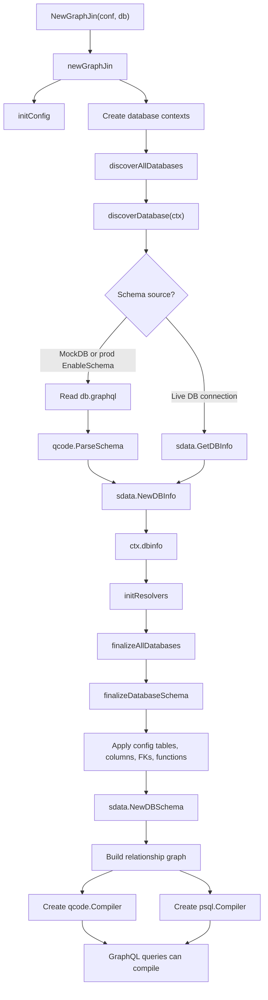
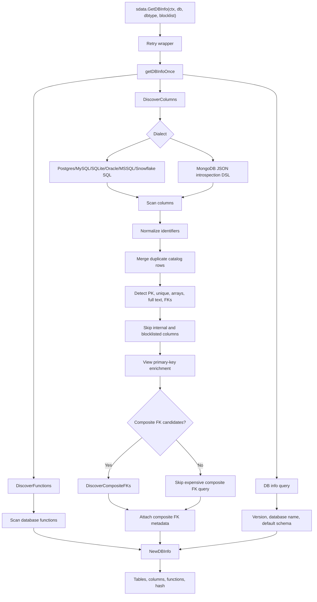
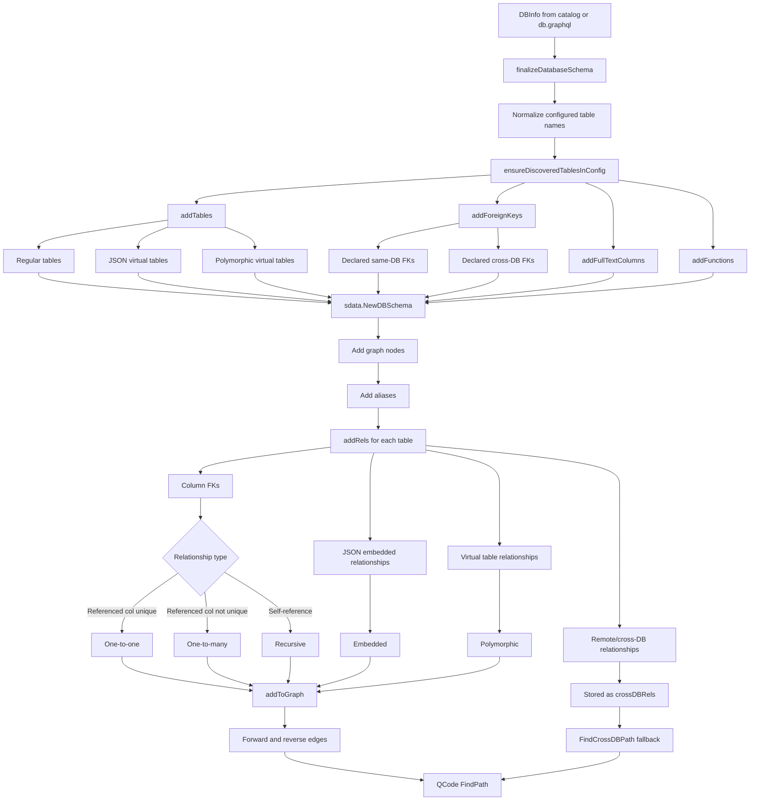
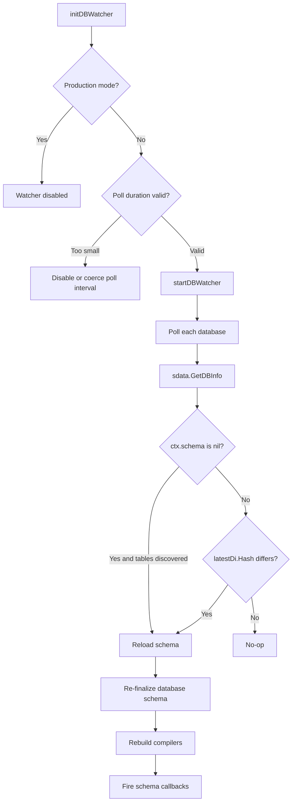
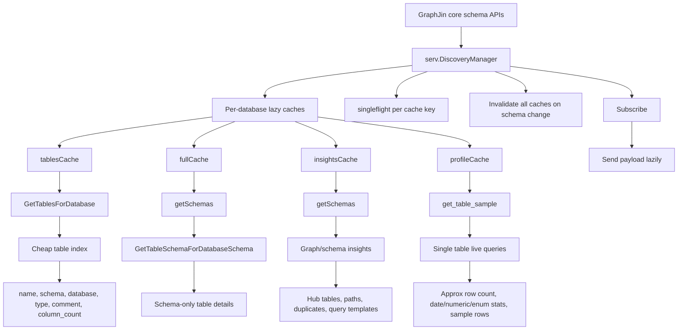
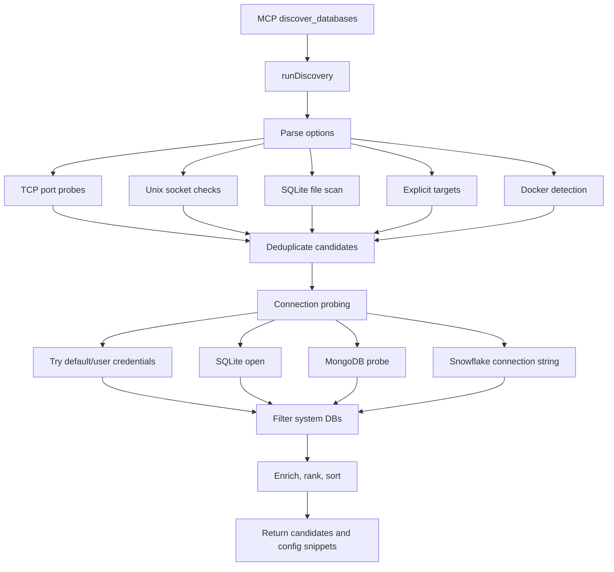
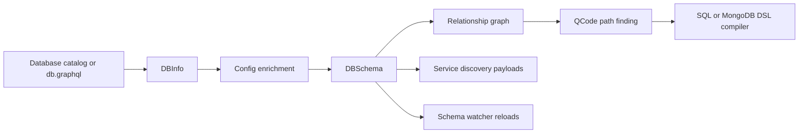

# GraphJin Discovery Mechanism

This note visualizes how GraphJin discovers database structure, enriches it with config, turns it into a relationship graph, and exposes higher-level discovery APIs.

## 1. Core Initialization Flow

Key files:

- `core/api.go`
- `core/init_multidb.go`
- `core/init.go`
- `core/internal/sdata/tables.go`
- `core/internal/sdata/schema.go`

## 2. Raw Catalog Discovery

Key files:

- `core/internal/sdata/tables.go`
- `core/internal/sdata/sql.go`
- `core/internal/sdata/sql/*_columns.sql`
- `core/internal/sdata/sql/*_info.sql`
- `core/internal/sdata/sql/mongodb_*.json`

## 3. Relationship Graph Build

Key files:

- `core/init.go`
- `core/internal/sdata/schema.go`
- `core/internal/sdata/dwg.go`
- `core/internal/qcode/qcode.go`

## 4. Runtime Schema Watcher

Key file:

- `core/watcher.go`

Note: while reading this path, I noticed `NewDBInfo` appears to assign `di.hash = h.Size()` rather than the digest value. Since `h.Size()` is constant for the hash algorithm, normal watcher change detection may not notice catalog changes.

## 5. Service Discovery Layer

Key files:

- `serv/discovery_cache.go`
- `serv/discovery_gen.go`
- `serv/discovery_sample.go`
- `serv/discovery_schema.go`
- `serv/discovery_rowcount.go`
- `serv/discovery_types.go`

The important performance boundary is that `NewDiscoveryManager` only registers schema-change invalidation. It does not build table indexes, full schemas, insights, or profiles at GraphJin startup.

Current lazy discovery contract:

| Tool or endpoint | Cost | Purpose |
| :--- | :--- | :--- |
| `list_tables(search, schema, limit, cursor, database)` | Cheap, in-memory | Paginated table index. No row counts or data profiling. |
| `describe_table(table, schema, database)` | Cheap, in-memory | One table schema only. Does not profile data. |
| `find_path(from, to, database)` | Cheap, graph-only | Relationship path between tables. |
| `get_schema_insights(database)` | Cheap, schema/graph-only | Hub tables, duplicate warnings, templates, overview/functions. |
| `explore_relationships` | Legacy, graph-only | Relationship graph exploration. |
| `get_table_sample(table, schema, database, mode)` | Expensive, live data | The only discovery tool allowed to run profiling/sample queries. |
| `discover_databases` | Separate onboarding | Finds database connection candidates, not schema details. |
| `reload_schema` | Separate mutating tool | Reloads GraphJin schema state. |

MCP uses the protocol-defined `outputSchema` field for tool metadata. The app-level discovery schema contract is available at `/api/v1/discovery/schema`.

## 6. MCP Database Discovery

This is separate from schema introspection. It discovers database endpoints and candidate connection configs.

Key file:

- `serv/mcp_discover.go`

## Mental Model

In short: catalog introspection creates `DBInfo`; config and resolvers enrich it; `NewDBSchema` creates the relationship graph; QCode uses that graph to plan joins; and the service layer packages the same discovered structure for assistant/MCP-facing discovery features.
