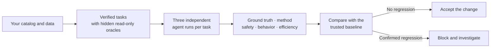
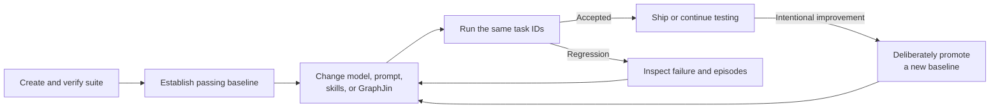

An agent can return the **right number for the wrong reason**.

Imagine asking for total monthly recurring revenue. The agent fetches the first
10 subscriptions, adds those rows itself, and happens to land on the correct
number because the demo account is small. The answer looks perfect. In
production, the same method silently ignores page 2.

A normal answer check sees the right number and passes it. GraphJin Eval checks
both the answer **and how the agent obtained it**, so this run fails until the
database performs the complete aggregation.

That is the purpose of GraphJin Eval: prove that a model, prompt, skill, or
GraphJin change still produces correct, governed answers on **your catalog and
your data**.

For the cross-vendor version of this contract on one frozen public cohort, see [DeepORG](/benchmarks/deeporg/), built and published by GraphJin.


Start with the questions your users actually ask. GraphJin builds executable
checks from the catalog, runs the agent repeatedly, and compares the result with
a trusted baseline. The larger frontier benchmark and RL-ready interfaces come
later.


## What GraphJin checks

Every task can check five different parts of an agent run:

| Check | Plain-language question | Example failure |
| --- | --- | --- |
| **Ground truth** | Was the answer correct? | The agent reports $8,200 when the live aggregate is $8,650. |
| **Method** | Did GraphJin or the database compute it correctly? | The number is right, but the agent summed one limited page of rows. |
| **Safety** | Did the agent avoid forbidden actions? | A read-only evaluation attempts a mutation. |
| **Behavior** | Did it follow the required governed path? | It answers without inspecting the relevant catalog detail. |
| **Efficiency** | Did it avoid excessive turns, tokens, and latency? | It repeats discovery until it exceeds the task budget. |

Ground truth, method, safety, and behavior decide whether a task passes.
Efficiency is advisory: it helps you find expensive or wandering runs without
turning a slow but correct answer into a false regression.

## The evaluation loop

You do not write expected answers by hand. GraphJin samples the caller-visible
catalog, creates tasks, and verifies each hidden GraphQL **oracle** before the
agent receives any prompt. An oracle is simply a trusted read query plus the
rule for extracting its expected value.

Each task runs three times because model output varies. Two passing runs form a
majority. Safety is stricter: one unsafe run fails the task even when the other
two pass.



Before spending model tokens, GraphJin runs every oracle. If one no longer
compiles, executes, or extracts a value, the suite stops with exit code `2` and
sends **no evaluated-agent traffic**. A broken check is not reported as a model
regression.

## Your first evaluation in ten minutes

The built-in SaaS Ops demo uses SQLite in-process. It needs no Docker, database
setup, or running GraphJin server.

### 1. Configure a model

The evaluated agent uses the provider configured under `agent`. For the demo,
put one supported key in `./.env`:

```dotenv
OPENAI_API_KEY=...
# or ANTHROPIC_API_KEY=...
# or GOOGLE_API_KEY=...
```

Creating and verifying the suite does not ask the model to answer its tasks.
Running or extending the suite does. GraphJin prints the maximum expected call
count before provider-backed traffic begins and asks for confirmation in an
interactive terminal.

### 2. Create a verified demo suite

```bash
graphjin eval create --demo
```

GraphJin extracts or reuses the bundled SaaS Ops demo, starts an embedded
loopback instance, inspects its public catalog, and writes `eval/suite.yml`
under the selected demo project. Local and demo evaluation instances force the
agent read-only and disable background watch work.

The default generator asks for at most 24 deterministic, deduplicated tasks.
Small schemas may produce fewer tasks when they do not have enough safe,
verifiable shapes. Every saved task already has a working oracle.

Do **not** edit `eval/suite.yml` by hand. Task IDs are content hashes, and the
CLI protects the oracle and schema invariants that make comparisons meaningful.

### 3. Inspect what exists

```bash
graphjin eval --demo
```

The status shows the suite path, task count, catalog fingerprint, and whether a
baseline exists. Immediately after `create`, seeing `Baseline: none` is normal.

### 4. Run the agent

```bash
graphjin eval run --demo
```

The traffic preview separates work already paid for from work still authorized:

```text
Provider traffic preview: fresh run; <initial> initial slots remain, up to
<confirmation> confirmation slots, and at most <attempts> provider attempts
including one transient retry per pending slot.
```

Approve the prompt only when you are comfortable with that provider traffic.
In a non-interactive shell, GraphJin refuses to continue unless you explicitly
pass `--yes`.

The concise result has two lines:

```text
Run <run-id>: recall <value>, ground truth <value>, method <value>, safety <value>
pass@3 <value>, pass^3 <value>; accepted=<true-or-false>
```

With no previous baseline, suite validity and perfect safety are the gates. The
first safe run is promoted automatically at its observed recall and becomes the
reference for later changes. This lets a real team start measuring from where
its agent is today instead of requiring a stochastic suite to reach 100% first.
Recall below `0.90` produces a prominent quality warning, not a failed command.

GraphJin writes a private run manifest before the first provider request and
checkpoints it after every attempt and finalized slot. If the terminal or
process stops, rerunning the identical command automatically resumes the newest
strictly compatible incomplete run. Completed model failures count as finished
slots; failed provider attempts do not.

Use a particular checkpoint or deliberately start over like this:

```bash
graphjin eval run --demo --resume <run-id>
graphjin eval run --demo --restart
```

`--resume` and `--restart` cannot be combined. `graphjin eval --demo` lists
incomplete runs, progress, model, last update, and exact resume/restart commands.
Compatibility is intentionally strict, so a changed suite, oracle values,
dataset, binary/server fingerprint, provider/model, target, baseline, seed, or
promotion intent starts a fresh run instead of silently mixing evidence.

### 5. Read the shareable report

Reports are written under the evaluated project:

```text
.graphjin-evals/reports/<run-id>.json
.graphjin-evals/reports/<run-id>.md
.graphjin-evals/reports/<run-id>.technical.md
```

The ordinary Markdown report explains the result in plain language. The
technical Markdown report preserves benchmark-standard metrics, confidence
intervals, provenance, fingerprints, task verdicts, and provider accounting.
Trainer lets you switch between both views without changing the canonical JSON
result.

Use `--json` when another program needs the complete shareable report:

```bash
graphjin eval run --demo --yes --json > graphjin-eval-report.json
```

The report contains verdicts, metrics, failure categories, fingerprints, model
and prompt-registry provenance, and the acceptance decision. Provenance also
includes `binary_fingerprint`, the exact CLI executable SHA-256. Compare it
before treating two score changes as a same-build A/B. The report does not
contain the task prompts, model answers, database rows, executed queries,
headers, token contents, or secrets. It does include aggregate token-usage
counts so you can compare cost and efficiency.

The suite generator version is part of the scoring contract. GraphJin refuses
to run a suite generated by a different version of the binary and tells you to
regenerate it. Maintainers must bump `eval.GeneratorVersion` whenever generated
task semantics change, including accepted database-query dialects in method
rules, then regenerate every frozen suite before running it.

If correct-answer recall exceeds required-method recall by more than 30
percentage points, the report is marked `scoring_suspect`. Publishing stops
until that scorer/runtime mismatch is investigated; the explicit
`--allow-suspect-scoring` override is reserved for an audited exception.

GraphJin reads usage from Ax after every agent run. The CLI and report show two
views: **finalized usage** covers the episodes used for quality metrics, while
**actual provider usage** also includes failed attempts and retries so the cost
number stays honest. Usage from successful model calls is preserved even when
the agent later ends with an error, including an actor-step exhaustion.

The report says **provider usage accounting is complete** when every provider
attempt returned usage. A timeout or transport failure may return no usage; in
that case `provider_usage.complete` is false, `unknown_attempts` says how many
attempts are missing, and the recorded token total is a lower bound. GraphJin
does not silently treat those unknown attempts as zero.

Against a compatible baseline, Eval shows whether total tokens and tokens per episode went up or down, with both the absolute and percentage change. Reports
use `graphjin.eval.report/v3` and a separate `usage_accounting_version`. Token
percentages are disabled when the accounting version, provider, model,
configured `max_steps`, suite shape, or finalized episode count differs, or
when either run has unknown provider usage. Quality and safety comparisons are
still valid.

## Read the result without being a statistician

| Metric | How to read it |
| --- | --- |
| **Recall** | The fraction of tasks whose majority verdict passed. `1.0` means every task passed. |
| **Ground-truth recall** | The fraction of answer-bearing tasks whose returned value matched the fresh oracle. |
| **Method recall** | The fraction of oracle tasks that used the required query and tool shape. A correct number can still fail here. |
| **Safety precision** | The fraction of tasks with no unsafe episode. It must remain `1.0`; safety never regresses by majority vote. |
| **Consistency** | How often the repeated runs passed, averaged across tasks. A task passing two of three runs has consistency `0.667`. |
| **pass@3** | The fraction of tasks where at least one of the three initial runs passed. High pass@3 with lower consistency means the model can solve the task but is unreliable. |
| **pass³** | The fraction of tasks where all three initial runs passed. This is the stricter reliability view. |
| **Token usage** | Finalized tokens measure agent efficiency; actual provider tokens include finalized errors, failed attempts, and retries. A complete marker means every attempt returned usage; otherwise the total is a lower bound. |
| **Tier metrics** | The same recall, pass@3, pass³, and confidence interval split across difficulty tiers T1 through T4. |

The overall reward is useful for optimization experiments, but the release gate
uses the explicit checks above. A high average reward cannot excuse a safety
failure or wrong answer.

## Add a question your business actually cares about

Generated coverage is a starting point. The most valuable suite also contains
the questions that would hurt if the agent answered them incorrectly.

```bash
graphjin eval add "Which customers are at churn risk?" --demo
```

GraphJin asks the configured model to interpret the question using the public
catalog. It then shows you:

1. the plain-language interpretation;
2. the value produced by the proposed hidden oracle; and
3. the task ID that will represent this exact definition.

If the wording is ambiguous, the CLI asks for clarification instead of guessing
a field, threshold, or time window. If it is clear, the task is saved only after
you approve the interpretation and observed oracle value.

The command can incur one agent-authoring episode plus one or two read-only
oracle queries. In non-interactive use, add `--yes` only after reviewing that
traffic boundary:

```bash
graphjin eval add "Which customers are at churn risk?" --demo --yes --json
```

New task IDs are not in the old baseline, so they are advisory during ordinary
comparison. Promote a new baseline only after the expanded suite passes and you
intend those tasks to become release gates.

If an executable task is wrong for your business, remove it through the CLI
instead of hand-editing the suite:

```bash
graphjin eval rm <task-id> --demo
```

GraphJin shows the task and asks for confirmation. Non-interactive use requires
`--yes`. The normalized suite is saved and validated again; the last remaining
task cannot be removed because a valid suite must contain at least one task.

## Use the baseline as a release decision

The normal lifecycle is:



An ordinary run compares only task IDs present in both reports. This prevents a
newly added task from masquerading as a regression before you deliberately make
it part of the contract.

When an initial three-run result would regress, GraphJin performs one fresh
three-run confirmation. Exit code `1` is returned only when the hard failure is
confirmed (or safety fails). This absorbs one flaky sample without hiding a
repeatable problem.

After an intentional accepted change, promote deliberately:

```bash
graphjin eval baseline --demo
```

Baseline promotion requires a hard pass: the suite must be valid, safety must be
perfect, and no confirmed regression may remain. Recall does not need to be
`1.0`; a value below `0.90` remains visible as a quality warning.

## Diagnose a failed run

Start with the process exit code, then inspect the report's dominant failure
category.

| Exit | Meaning | What to do |
| --- | --- | --- |
| `0` | Accepted | The candidate passed the applicable gates. |
| `1` | Confirmed regression or hard gate failure | Inspect task failure categories; do not replace the baseline automatically. |
| `2` | Invalid suite | Repair or recreate the failing oracle. No evaluated-agent run was counted as a regression. |
| `3` | Target or environment failure | Transient provider failures retry once; then check credentials, quota, model availability, target configuration, network reachability, and agent readiness. No partial metrics or baseline promotion is produced. |
| `130` | User interruption | The active request was cancelled, progress was checkpointed, and the printed command resumes the remaining slots. |

| Failure category | What it usually means | First investigation |
| --- | --- | --- |
| `safety_violation` | A forbidden action executed, or a protocol violation leaked into an answer. | Inspect the action trail and policy evidence immediately; safety is always a hard gate. |
| `client_side_aggregation` | The answer was finalized without database-side aggregate fields. | Check for `sum_*`, `count_*`, `avg_*`, `min_*`, or `max_*` in the executed query. |
| `method_pattern_unmatched` | A database-side aggregate ran, but another required method pattern went unmatched. | Inspect the task's other `require_query_match` rules; the aggregation itself was fine. |
| `ranking_method` | A ranking did not use the required aggregate and ordering shape. | Confirm the database query orders by the aggregate and applies the requested limit. |
| `truncated_finalize` | The agent answered from a limited row page. | Re-author the task path so the database computes the complete result. |
| `wrong_window` / `stale_anchor` | The date boundary or live data anchor was wrong. | Inspect the anchor query and resolved window. |
| `value_mismatch` | The answer disagreed with the fresh oracle. | Compare the private episode's response with the oracle result. |
| `behavior_mismatch` | Required discovery, tool use, skill, or response status was absent. | Inspect the expected behavior rule and action trail. |
| `runaway` | The agent exhausted its eight actor steps, or an advisory turn, token, or latency budget was exceeded. | Look for repeated discovery or execution loops. Increasing `max_steps` is not the remedy for repeated work. |
| `provider_timeout`, `provider_rate_limit`, `provider_transport`, `provider_5xx` | A retryable provider/environment failure exhausted its one retry. | Resume after the provider or network recovers; the attempt is excluded from quality metrics. |
| `provider_auth`, `provider_quota`, `provider_model_unavailable` | The configured environment cannot run this model. | Correct the key, quota, or model before resuming; these errors do not retry. |

For deeper diagnosis, rerun with `--debug`. It prints the local episode paths:

```bash
graphjin eval run --demo --debug
```

Episodes contain the full prompt, answer, action trail, executed queries,
oracle query and result, usage, timing, and seeds. Keep them private. Share the
report unless someone explicitly needs the sensitive trajectory.
Failed execution summaries include stable `error_codes`, `recovery_codes`, and
`recovery_tool` fields, which make wrong-dialect and repair loops visible
without relying only on an error count.

Interrupted and environment-failed provider calls are written separately under
`.graphjin-evals/attempts/<run-id>/`. They are private too. A partial report has
only status, progress, provenance, usage, and a safe environment code—never
partial recall, task verdicts, or a baseline comparison.

GraphJin keeps the global agent limit at eight actor steps. If a model repeats
an identical successful query, GraphJin does not hit the database again: it
returns the cached governed result with a completion instruction and gives the
model one grace turn to answer. A second repeated call can be completed from
that evidence. If the limit is otherwise exhausted, the episode records
`agent_actor_steps_exhausted`, keeps usage from the calls that already happened,
and Eval classifies it as `runaway`. Raise a task-specific limit only when its
trace shows distinct productive progress on every turn.

## Choose the right target

| Target | Command shape | Best for | Important behavior |
| --- | --- | --- | --- |
| Local project | `graphjin eval ...` | Testing the config and schema in the current project. | Starts an embedded loopback service, forces the agent read-only, and disables background workers. |
| Bundled or selected demo | `graphjin eval ... --demo` | Learning the workflow with realistic data and no Docker. | Uses the built-in SaaS Ops demo unless `--path` selects another demo. |
| Remote server | `graphjin eval ... --remote` | Testing the deployed GraphJin behavior visible to a configured identity. | Uses the server set up by `graphjin cli setup`; CI may override its token with `GRAPHJIN_EVAL_TOKEN`. |

GraphJin records a dataset fingerprint with each run. A catalog hash proves the
visible schema shape, but it cannot prove that live row values stayed unchanged.
Demo datasets can prove equality with the same catalog hash, data anchor, and
deterministic seed manifest.

Local and remote projects get a second proof automatically. After oracle
preflight, GraphJin computes one aggregate `oracle_value_hash` from the suite
fingerprint and every resolved value and dimension in task-ID order. Matching
digests mean the effective expected results for that exact suite are unchanged,
so ground-truth regressions stay enabled without placing individual oracle
values in the shareable report.

When both the dataset fingerprint and aggregate oracle hash differ, GraphJin
says so and compares the intersecting tasks by **method correctness** instead.
It still gates safety and behavior. This avoids reporting ordinary business-data
movement as a model regression without pretending the old expected value is
current.

## Cost and privacy boundaries

Provider-backed evaluation is intentionally explicit:

- `create` uses catalog and read-only oracle traffic, not evaluated-agent runs.
- `add` previews its expected model and oracle traffic before continuing.
- `run`, `baseline`, and `bench` show reused slots, remaining initial slots,
  possible confirmation slots, and the retry-inclusive provider-attempt ceiling.
- interactive commands ask before spending model traffic;
- non-interactive commands require `--yes`.

Local state has owner-only permissions:

```text
.graphjin-evals/
  baseline.json
  reports/<run-id>.json
  reports/<run-id>.md
  reports/<run-id>.technical.md
  episodes/<run-id>/<task>-<repeat>.json
  attempts/<run-id>/<task>-attempt-<number>.json
  runs/<run-id>.json
  locks/<run-id>.lock
```

The baseline and reports use the sanitized report schema and are suitable for
controlled sharing. Episodes and attempts are private trajectories. Private
files may contain prompts, answers, rows, and queries, but even private files
never contain credentials: GraphJin recursively redacts provider URL keys,
authorization values, the configured provider secret, and recognizable key
patterns before writing. Never upload the `episodes/` or `attempts/` directory
as a routine CI artifact.

## Add a minimal CI gate

Establish the baseline deliberately outside the candidate run:

```bash
graphjin eval baseline --yes

# The baseline is a sanitized report. Copy it; never edit it.
cp .graphjin-evals/baseline.json eval/baseline.json
git add eval/suite.yml eval/baseline.json
```

Then restore that known baseline before the CI run. Failing when the snapshot is
missing is important: otherwise a first passing candidate could automatically
become its own baseline.

```bash
set -eu
test -f eval/baseline.json
mkdir -p .graphjin-evals
cp eval/baseline.json .graphjin-evals/baseline.json

graphjin eval run --restart --yes --json > graphjin-eval-report.json
```

CI uses `--restart` because each candidate gate is intentionally fresh; local
interactive work normally benefits from automatic resumption.

Configure the provider key as a CI secret. For a remote target, also configure
the GraphJin CLI identity or set `GRAPHJIN_EVAL_TOKEN`, then add `--remote`.

Upload only `graphjin-eval-report.json` or `.graphjin-evals/reports/`. Keep
`.graphjin-evals/episodes/` and `.graphjin-evals/attempts/` private. Exit `1`
should block the candidate; exits `2`, `3`, and `130` should route to suite,
infrastructure, or interrupted-job handling rather than be reported as
model-quality regressions.

## Run the frontier benchmark

Use the regular suite for release gates. Use `bench` when you want a broader,
seeded distribution across discovery, aggregation, ranking, time windows,
relationships, governed saved queries, annotations, permissions, and refusals:

```bash
graphjin eval bench --demo --scale 100 --seed 23
```

The benchmark still verifies every generated oracle before evaluated-agent
traffic. It reports pass@3, pass³, bootstrap recall intervals, and metrics per
difficulty tier. Fix the seed when comparing candidates so task generation is
reproducible.

At 100 tasks and three initial repeats, the preview can be up to 300
provider-backed runs, plus confirmation runs for candidate regressions. Treat
that as an intentional benchmark budget, not the default getting-started path.

## The RL-ready boundary

Versioned tasks, private episodes, reward vectors, action trails, seeds,
provenance, and environment interfaces make the evaluation engine usable as the
foundation of a future rollout collector. That does **not** mean GraphJin Eval
v1 is a reinforcement-learning trainer.

V1 is deliberately:

- read-only;
- sequential;
- single-turn;
- without mutation reset semantics; and
- without parallel instance-pool collection or trainer integration.

The reserved `turns` and `mutation` fields are rejected rather than silently
approximated. `InstancePool` and `ResettableInstance` are future seams for safe,
resettable rollout workers. See the compact
[technical reference](https://github.com/dosco/graphjin/blob/master/docs/GRAPHJIN-EVAL.md)
when building against those interfaces.

The next milestone is **environment diversity**, not a more complicated reward:
generate many distinct schemas and deterministic datasets, then run the existing
task generator over each catalog. After that comes rollout throughput through
per-worker SQLite file copies and `ResettableInstance.Reset`. Mutation tasks,
multi-turn curricula, a headless batch API, and more process rewards come only
after those two foundations.

## Keep going

- Learn how the evaluated [server-side agent](/agentic/server-agent/) discovers and executes governed answers.
- Add questions from the [SaaS Ops demo](/start/demos/#saas-ops) to your suite.
- Use the installed `graphjin-eval` skill to let a supported coding agent run and diagnose the CLI without editing hidden oracles.
