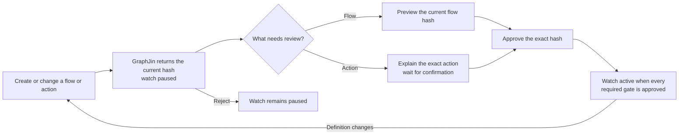
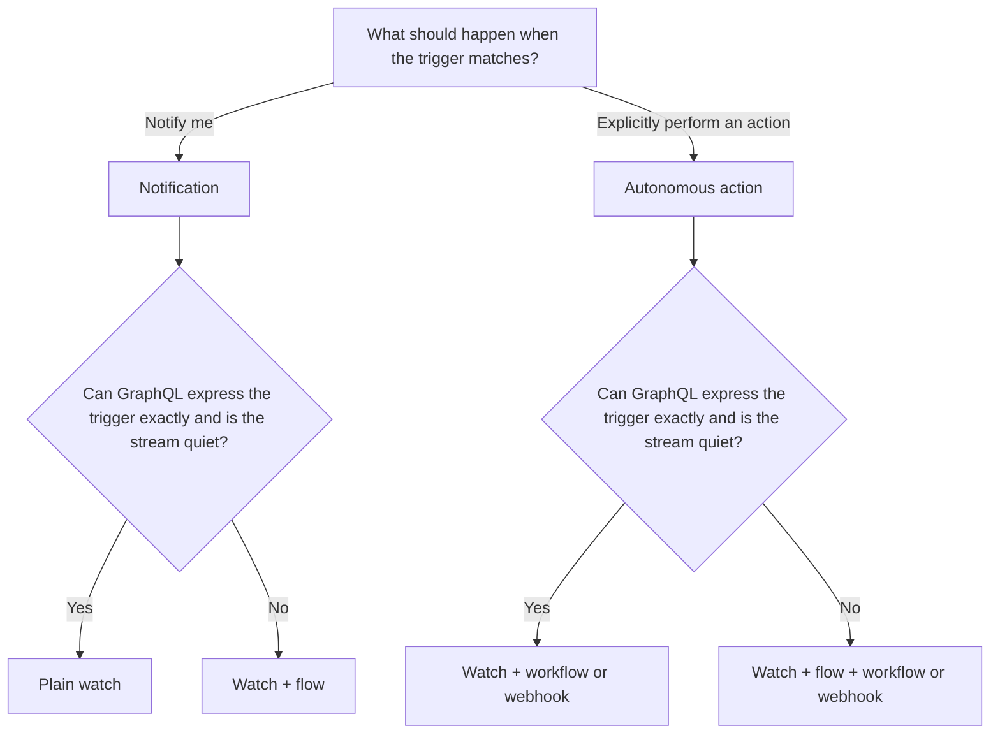

A watch answers **when should GraphJin pay attention?** A flow answers **what does this event mean?** A workflow answers **what should GraphJin do about it?**

Those are separate jobs:

- A **watch** keeps a cursor-backed query running and records matching changes.
- A **flow** is a small, tool-free AI filter. It can summarize, score, or suppress noise, but it cannot query more data or change anything.
- A **workflow** is an action with hands. It can call approved GraphJin tools and GraphQL, so GraphJin never infers permission to attach one from phrases such as "tell me" or "let me know."

## What makes GraphJin highly reactive

GraphJin does not wait for the next prompt. It keeps governed questions running, carries their state across reconnects, and treats both activity and silence as evidence.

| Reactive primitive | What it adds |
| --- | --- |
| Change watch | React to new cursor-backed query results without polling from an agent conversation. |
| Absence watch | Emit a first-class event when expected data does not arrive within a window. |
| Flow triage | Turn each event into `notify`, `digest`, or `discard` without giving the model tools. |
| Digest drain | Coalesce routine events into one unseen summary without another model call. |
| Rollup watch | Gather events from exact watch IDs for safe cross-watch correlation. |
| Per-watch inbox + snooze | Wake only the right conversation, or defer an event without acknowledging it. |
| Durable recovery | Resume from stored cursors, reconnect after drops, and exponentially back off transient failures. |
| Approved action | Run a workflow or webhook only after its exact action hash is reviewed. |

## The 60-second story

One conversation asks, "Watch the roast telemetry and tell me if something looks wrong." GraphJin creates a cursor-backed roast watch with a tool-free flow. The watch is stored but paused while the flow is previewed against representative readings. The preview shows which samples would be discarded, added to a digest, or sent as notifications.

After the user approves that exact `flow_hash`, the watch runs continuously. Routine phase changes collect into a digest. When Batch 7 begins drifting after first crack, the flow produces one compact warning and GraphJin wakes only the roasting conversation subscribed to that watch.

A second watch asks for an event when no inbound shipment scan arrives for four hours. GraphJin treats that silence as an `absence` event. An operations rollup watches the exact shipment and inventory watch IDs; when shipment silence coincides with inventory below its buffer, its flow creates one correlated warning for the operations conversation. An operator can snooze that warning without marking it seen.

If the user then asks GraphJin to draft a supplier escalation, GraphJin proposes a workflow action and pauses again. The workflow can run only after the user separately confirms the exact `action_hash`. If the subscription drops meanwhile, GraphJin resumes from its stored cursor and retries transient failures with bounded exponential backoff.


Once the current flow or action hash is approved, the watch keeps running without asking again for every event. Changing the query, variables, flow, delivery configuration, or resolved workflow source creates a new version and requires the affected approval again.




## The two questions

First ask whether the trigger is mechanical or needs judgment. Then ask whether the user wants a notification or an action.

| Trigger | Requested result | Use |
| --- | --- | --- |
| Mechanical: "status is late", "temperature is above 400" | Tell me | Plain watch |
| Needs judgment or produces lots of noise: "looks likely to slip", roast telemetry every few seconds | Tell me | Watch + flow |
| Mechanical | Explicitly do something | Watch + workflow or webhook |
| Needs judgment or produces lots of noise | Explicitly do something | Watch + flow + workflow or webhook |



Examples:

- "Let me know when a purchase order becomes late" is a plain watch. `let me know` does not authorize an action.
- "Watch the roast telemetry and tell me if something looks wrong" is a watch with a flow because the stream is noisy and "looks wrong" needs judgment.
- "When inventory drops below reorder, draft a purchase order" is a watch with a workflow because both the trigger and requested action are explicit.
- "If supplier activity looks likely to cause a shortage, draft a purchase order" uses a flow to make the semantic decision and a workflow to take the approved action.

Put exact conditions in the subscription's GraphQL `where` filter. A flow is appropriate when a useful predicate cannot be written exactly, or when frequent raw events need distillation.

Silence is an explicit trigger: add `absence_json: { enabled: true, window: "4h", repeat: false }` for "no event in four hours." Same-watch flow noise can drain through `delivery_json.digest.window`; cross-watch correlation uses a rollup watch over `gj_watch_event` with a conjunctive non-self `watch_id eq/in` filter. Changing these governed fields can change the action hash and require re-approval.

## One interface: `gj_watch`

`gj_watch` creates, reads, updates, pauses, reviews, approves, rejects, and deletes a watch. Review inputs are mutation commands, not stored definition fields.

A plain notification watch has no model cost and can start immediately:

```graphql
mutation {
  gj_watch(
    insert: {
      name: "late_pos_conversation_42"
      query: "subscription { purchase_orders(where: { status: { eq: \"late\" } }, first: 25, after: $cursor) { id status } purchase_orders_cursor }"
    }
  ) {
    id
    status
    enabled
  }
}
```

Give every logical conversation a unique name and retain the returned ID. A watch ID is derived from its owner and name.

## Flow review

A new or changed flow is stored but paused. The watch projects `flow_hash`, `flow_approval`, and `flow_preview_json`; reading those fields never calls a model.

Preview the current hash with explicit samples:

```graphql
mutation {
  gj_watch(
    where: { id: { eq: "watch:..." } }
    update: {
      flow_review_json: {
        decision: "preview"
        expected_flow_hash: "..."
        samples_json: [{ temperature: 421, phase: "first_crack" }]
      }
    }
  ) {
    id
    flow_hash
    flow_approval
    flow_preview_json
    status
    enabled
  }
}
```

After inspecting the preview, approve the same hash with `decision: "approve"`, or reject it with `decision: "reject"`. Approval succeeds only when the stored preview completed successfully for the current flow hash. The preview records counts for `notify`, `digest`, and `discard`, sample results, usage, duration, and errors in the watch's review evidence.

Flows use the configured server model, so each uncached evaluation has model cost and latency. Plain watches do not. An identical event under the same flow hash reuses its existing verdict; changing the flow hash deliberately causes new evaluation.

A preview makes the tradeoff visible before the watch is activated. For example:

| Representative event | Flow verdict | Downstream behavior |
| --- | --- | --- |
| Batch 7 reaches first crack at 421°F and continues drifting | `notify` · `warn` · "Batch 7 is drifting after first crack." | Keep the event unseen and wake the roast watch resource. |
| Routine phase progression worth reviewing later | `digest` · `info` · short summary | Queue it for a digest without waking the conversation. |
| A duplicate stable reading with no new information | `discard` · `info` · short reason | Suppress it without waking the conversation. |

These rows illustrate the contract; the configured flow determines the real verdict for each event.

## Action review

Workflow and webhook delivery can cause side effects. Creating or changing autonomous delivery therefore pauses the watch and projects an `action_hash` with `action_approval: "pending"`.

The action hash pins all behavior that matters:

- inline or saved query source
- variables
- flow configuration
- delivery configuration
- resolved workflow source

An agent may create the proposal and explain its exact effect, but it must stop for user confirmation. It cannot create or change an autonomous action and approve it in the same agent run. After the user confirms, approve only the current hash:

```graphql
mutation {
  gj_watch(
    where: { id: { eq: "watch:..." } }
    update: {
      action_review_json: {
        decision: "approve"
        expected_action_hash: "..."
      }
    }
  ) {
    id
    action_hash
    action_approval
    status
    enabled
  }
}
```

Use `decision: "reject"` to reject the proposed action. A stale hash is refused instead of approving behavior the reviewer did not see.

## Lifecycle and reapproval

Flow and action approvals are independent. A semantic action watch does not run until both are approved. Definition changes cannot be combined with review commands in one mutation.

Changing the query, variables, flow, delivery target, or resolved workflow source invalidates the approvals affected by that change and pauses the watch. Review the new hashes before resuming. Plain notification watches remain active because they have neither approval gate.

| Watch configuration | Required review state | Runtime state |
| --- | --- | --- |
| Plain notification | No flow or action approval required | Active immediately |
| Watch + flow | Current flow hash approved | Active after a successful preview and approval |
| Watch + workflow or webhook | Current action hash approved | Active after explicit action confirmation |
| Watch + flow + workflow or webhook | Both current hashes approved | Active only when both gates pass |
| Any required gate is pending or rejected | Combined `approval` is not approved | Paused and disabled |

The failure rule follows the risk:

- **Alerts fail open.** A flow failure may send the raw event to the inbox so an AI outage does not silence an alert.
- **Actions fail closed.** A flow failure never executes a workflow or webhook.
- A stale or missing action approval never performs delivery.

## Deliver updates to the right conversation

For MCP, retain each conversation's watch IDs and subscribe to each concrete resource:

```text
graphjin://watch-events/unseen/{watch_id}
```

GraphJin routes a modern event only to the matching per-watch subscription. The notification URI identifies which watch changed; read the resource or query `gj_watch_event` for the event data.

| Conversation | Retained watch | Subscription | What wakes it |
| --- | --- | --- | --- |
| Roasting | `watch:coffee_roast_<suffix>` | `graphjin://watch-events/unseen/watch%3Acoffee_roast_<suffix>` | Only events from the roast watch |
| Purchasing | `watch:late_po_<suffix>` | `graphjin://watch-events/unseen/watch%3Alate_po_<suffix>` | Only events from the purchase-order watch |

The two conversations may share the same authenticated owner and account. Exact watch subscriptions still keep their wakeups, reads, and acknowledgements separate.

The aggregate `graphjin://watch-events/unseen` resource remains available for hosts that cannot subscribe per URI. When using it, filter to the conversation's retained watch IDs before reading full payloads or marking anything seen. If a session holds aggregate and exact subscriptions, the exact subscription takes precedence for events carrying a watch ID.

## Tune from evidence

The first choice is not permanent:

1. Start with the smallest watch that matches the request.
2. Preview a flow against representative samples before approving it.
3. If unseen events pile up, tighten the GraphQL filter or add/tune a flow.
4. If the flow discards useful alerts, loosen it and preview the revision.
5. If `failure_count` grows or `last_error` changes, repair the watch before adding automation.
6. Add an autonomous workflow only when the user asks for the action and confirms the exact current hash.

See [Watches](/agentic/watches/) for lifecycle, inbox, delivery, and cleanup details, and [Workflows](/agentic/workflows/) for authoring reviewed actions.
